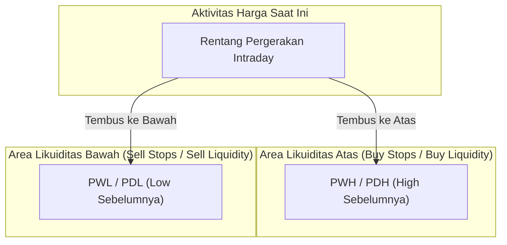

# 00. Base Knowledge: Fondasi Pasar, Likuiditas, dan Struktur Data

Dokumen ini menyajikan konsep fundamental perdagangan finansial, struktur pasar instrumen XAUUSD, anatomi *candlestick*, definisi teknikal level likuiditas acuan, serta pengaruh sesi pasar global yang menjadi landasan teoritis riset ini.

---

## 1. Karakteristik Instrumen XAUUSD (Gold / Emas Spot)

**XAUUSD** merepresentasikan nilai tukar 1 troy ounce (±31,1035 gram) emas murni terhadap Dolar Amerika Serikat (USD). 

| Karakteristik | Deskripsi Teknis | Implikasi Terhadap Riset |
| :--- | :--- | :--- |
| **Likuiditas Pasar** | Sangat tinggi, diperdagangkan secara global 24 jam sehari (Senin–Jumat). | Sering terjadi penumpukan order likuiditas masif di level-level kunci. |
| **Dinamika Volatilitas** | Pergerakan harga dipengaruhi oleh inflasi global, suku bunga, risiko geopolitik, dan arus modal institusional. | Nilai harga absolut berubah drastis ($1.100 $\rightarrow$ $4.100+), mewajibkan normalisasi berbasis ATR (*Average True Range*). |
| **Sifat Volume** | Data dari broker forex/CFD umumnya berupa *Tick Volume* (frekuensi pembaruan kuotasi harga), bukan *Real Centralized Volume*. | Fitur volume harus diperlakukan secara hati-hati sebagai indikator aktivitas relatif, bukan volume modal riil. |

---

## 2. Anatomi Candlestick

*Candlestick* merangkum 4 titik data harga penting dalam suatu interval waktu tertentu:

```text
       High (Harga Tertinggi)
         |
    +----+----+  <-- Upper Wick / Shadow
    |         |
    |  Body   |  Open / Close (tergantung Bullish/Bearish)
    |         |
    +----+----+  <-- Lower Wick / Shadow
         |
        Low (Harga Terendah)
```

1. **Open ($O$):** Harga transaksi pertama pada interval tersebut.
2. **High ($H$):** Harga tertinggi yang tercapai selama interval.
3. **Low ($L$):** Harga terendah yang tercapai selama interval.
4. **Close ($C$):** Harga transaksi terakhir pada penutupan interval.
5. **Body:** Rentang antara harga *Open* dan *Close* ($|C - O|$).
6. **Wick / Shadow:** Rentang ekor yang menunjukkan penolakan harga (*rejection*) di luar body.

---

## 3. Konsep Level Likuiditas (*Liquidity Levels*)

Secara mikrostruktur pasar (Kavajecz & Odders-White, 2004; Osler, 2003, 2005), **likuiditas** bukanlah sekadar garis abstrak di grafik, melainkan area harga tempat terkonsentrasinya pesanan beli/jual tertunda (*pending orders*), khususnya:
- **Stop-Loss Orders:** Perintah pemotongan rugi dari trader yang sedang menahan posisi.
- **Breakout Buy/Sell Stop Orders:** Perintah masuk posisi otomatis ketika harga menembus level tertentu.

Level harga ekstrem periode sebelumnya secara alamiah menjadi magnet likuiditas utama:



### 3.1 PWH (Previous Week High) & PWL (Previous Week Low)
- **PWH:** Titik harga tertinggi yang dicapai pada pekan perdagangan sebelumnya (Senin s/d Jumat).
- **PWL:** Titik harga terendah yang dicapai pada pekan perdagangan sebelumnya (Senin s/d Jumat).
- **Karakteristik:** Mewakili dinamika struktural jangka menengah (*weekly structural liquidity*).

### 3.2 PDH (Previous Day High) & PDL (Previous Day Low)
- **PDH:** Titik harga tertinggi yang dicapai pada hari sesi perdagangan sebelumnya ($D-1$).
- **PDL:** Titik harga terendah yang dicapai pada hari sesi perdagangan sebelumnya ($D-1$).
- **Karakteristik:** Mewakili dinamika likuiditas harian/intraday yang menjadi fokus utama dalam riset ini.

---

## 4. Timeframe Analisis

| Timeframe | Durasi 1 Candle | Peran dalam Riset Ini |
| :--- | :--- | :--- |
| **Daily (D1)** | 1 Hari Perdagangan Penuh | **Level Acuan:** Digunakan untuk mengekstrak nilai pasti level PDH dan PDL dari hari sesi sebelumnya ($D-1$). |
| **Weekly (W1)** | 1 Pekan Perdagangan (Senin–Jumat) | **Level Acuan:** Digunakan untuk mengekstrak nilai level PWH dan PWL dari pekan sebelumnya ($W-1$). |
| **Hourly (H1)** | 1 Jam Perdagangan | **Timeframe Observasi & Evaluasi Utama:** Seluruh deteksi sentuhan pertama ($T_0$) dan evaluasi jendela observasi $N=6$ candle dihitung pada data H1. |

> **Mengapa Memilih H1 dengan Jendela $N=6$ Candle?**
> Jendela 6 jam ($N=6$) pada data H1 secara realistis merangkum **1 sesi perdagangan utama penuh** (misalnya sesi London berdurasi ±6-8 jam atau sesi New York berdurasi ±6-8 jam). Rentang ini memberikan waktu yang cukup bagi pasar institusional untuk menyelesaikan akumulasi/distribusi likuiditas tanpa terdistorsi oleh noise mikro (seperti pada timeframe M1/M5).

---

## 5. Sesi Pasar Global dan Sensitivitas Zona Waktu

Aktivitas trading XAUUSD bergerak mengikuti putaran matahari melalui 3 pusat finansial utama dunia:

| Sesi | Rentang Waktu Acuan (Lokal) | Karakteristik Pergerakan |
| :--- | :--- | :--- |
| **Sesi Asia (Tokyo/Sydney)** | ± 00:00 – 08:00 UTC | Volatilitas relatif rendah, sering membentuk rentang (*ranging*). Cenderung menghasilkan rasio *sweep* lebih tinggi. |
| **Sesi London (Eropa)** | ± 07:00 – 16:00 UTC | Volume dan volatilitas meningkat drastis. Pembukaan sesi London sering memicu perburuan likuiditas Asia. |
| **Sesi New York (Amerika)** | ± 12:00 – 21:00 UTC | Jam tumpang tindih (*overlap*) London-NY (12:00–16:00 UTC) merupakan periode paling likuid dan volatil dalam sehari. |
| **Off-Session** | 21:00 – 00:00 UTC | Jeda likuiditas setelah penutupan pasar New York. |

> **⚠️ Peringatan Kritis Batas Hari & Daylight Saving Time (DST)**
> 1. **Batas Hari Finansial (Session Cutoff):** Batas pergantian hari pasar valuta asing dan komoditas global adalah **17:00 waktu New York** (pukul 21:00 atau 22:00 UTC tergantung DST), **bukan pukul 00:00 UTC**.
> 2. **Candle Minggu:** Pembukaan pasar pada Minggu malam waktu New York (pukul 17:00 NY) adalah bagian dari sesi perdagangan hari Senin. Memperlakukan candle Minggu sebagai hari terpisah mencemari 27,9% data level PDH/PDL.
> 3. **Penanganan DST:** Karena pergeseran musim panas/dingin di AS dan Eropa tidak serentak, pelabelan sesi wajib menggunakan fungsi berbasis zona waktu astronomis (`from_utc_timestamp`) dan bukan penambahan offset statis.
