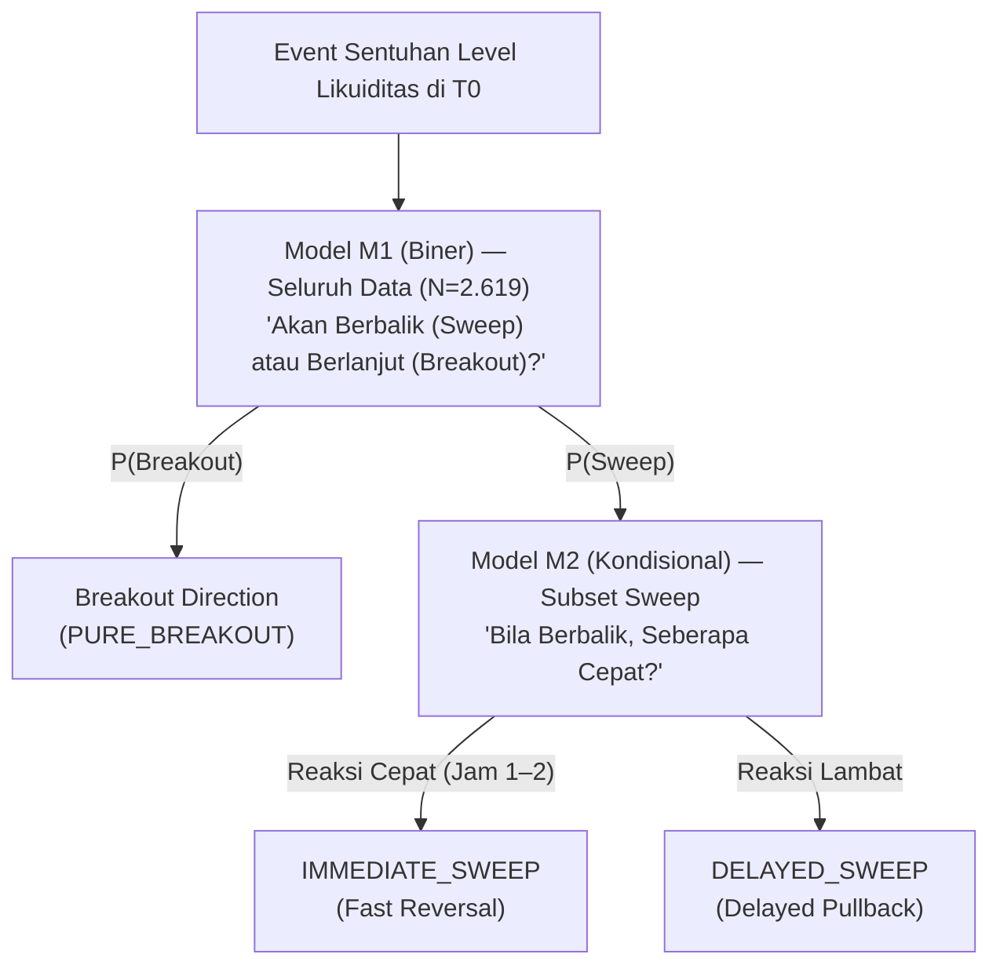

# 06. Fase 3: Pemodelan Prediktif & Sistem Pendukung Keputusan (DSS)

Dokumen ini memaparkan spesifikasi teknis Tahap 3 (Prediktif) yang menjawab **Rumusan Masalah 3 (RM3)**: *"Sejauh mana model machine learning mampu mengestimasi probabilitas sweep vs breakout secara terkalibrasi, dan apakah kemampuannya mengungguli garis dasar (base rate dan tebakan naif)?"*.

---

## 1. Matriks Objektif Fase 3 (P1 – P9)

```text
Fase 1: "Seberapa sering?"          --> Base Rate 51,58%
Fase 2: "Dalam kondisi apa?"        --> Fitur Kontekstual (5 Famili) & IV
Fase 3: "Berapa probabilitasnya?"   --> Probabilitas Terkalibrasi + Abstain Zone
```

| Kode | Objektif Prediktif | Output Konkret & Definisi Operasional |
| :---: | :--- | :--- |
| **P1** | **Formalisasi Task ML** | Penetapan unit observasi ($T_0$), horizon ($N=6$), dan struktur model hierarkis (M1/M2). |
| **P2** | **Garis Dasar Berjenjang (*Tiered Baselines*)** | Tiga baseline wajib (**B0, B1, B2**) yang harus dikalahkan oleh model utama. |
| **P3** | **Protokol Validasi Anti-Kebocoran** | *Purged Expanding Walk-Forward CV* (6 fold: 2019 $\rightarrow$ 2024) + *Embargo* 6 candle. |
| **P4** | **Pemilihan & Penyetelan Model** | *LightGBM* dan *Logistic Regression* dengan optimasi Bayesian / Grid Search. |
| **P5** | **Metrik Evaluasi & Kalibrasi** | **PR-AUC, Brier Score, ECE, MCC, Kurva Reliabilitas**, dan *Platt Scaling* / *Isotonic Regression*. |
| **P6** | **Kebijakan Keputusan DSS** | Ambang batas keputusan probabilistik + **Zona Abstain (*Abstain Zone*)**. |
| **P7** | **Pernyataan Batasan Statistik** | Penegasan evaluasi kualitas probabilistik non-finansial (tanpa simulasi profit). |
| **P8** | **Interpretabilitas & Explainability** | SHAP (*SHapley Additive exPlanations*) global & visualisasi waterfall per-event. |
| **P9** | **Validasi Out-of-Sample Final** | Pengujian OOS terkunci (2025–Juli 2026, 387 event) — **dijalankan tepat 1 kali**. |

---

## 2. P1 — Formalisasi Task & Rekomendasi Model Hierarkis

### 2.1 Spesifikasi Task
- **Unit Observasi:** Satu baris event = sentuhan pertama harga pada level likuiditas di waktu $T_0$.
- **Keluaran Model:** Vektor probabilitas yang terkalibrasi $\hat{P} \in [0, 1]$, **bukan label biner hitam-putih**.
- **Waktu Keputusan:** Dilakukan tepat saat penutupan candle crossover $T_0$ menggunakan fitur yang tersedia secara *point-in-time*.

### 2.2 Arsitektur Model Hierarkis Dua Tingkat (M1 & M2)
Memecah problem multiclass menjadi dua model yang lebih stabil:



1. **Model M1 (Struktural - Biner):** Membedakan *Sweep* vs *Breakout* ($P(Y=1 \mid X)$) menggunakan seluruh 2.619 event harian.
2. **Model M2 (Kecepatan Pembalikan - Kondisional):** Membedakan `IMMEDIATE_SWEEP` vs `DELAYED_SWEEP` pada subset event *sweep*.
3. **Keuntungan:** Menjaga kestabilan estimasi kelas dominan saat kelas minoritas mengalami volatilitas.

---

## 3. P2 — Sistem Garis Dasar Berjenjang (*Tiered Baselines*)

Sebuah model Machine Learning hanya dapat diklaim memberikan nilai tambah jika terbukti secara statistik mengungguli garis dasar berikut:

| Tingkat Baseline | Definisi & Formula | Sumber Metodologis | Makna Ilmiah Bila Model Gagal Mengalahkan |
| :--- | :--- | :---: | :--- |
| **B0 (Garis Dasar Nol)** | Tebak selalu kelas mayoritas (*Base Rate* harian: 51,58%). | D3 (Fase 1) | Model sama sekali tidak mempelajari pola pasar. |
| **B1 (Garis Dasar Aturan Tunggal)** | Aturan heuristik terbaik (misal: `IF adr_used_pct > 80% THEN Sweep`). | G3 / G5 (Fase 2) | Machine Learning kompleks tidak memberikan nilai tambah di atas aturan sederhana. |
| **B2 (Garis Dasar Linier)** | Regresi Logistik teratur (L2) menggunakan 5 fitur teratas berdasarkan Information Value (IV). | G2 (Fase 2) | Kompleksitas model non-linier (*tree-based*) tidak sepadan dengan hilangnya interpretabilitas. |

> **Prinsip Parsimoni:** Jika model *Gradient Boosting* hanya unggul tipis ($< 1,5\%$) di atas Regresi Logistik, **pilih Regresi Logistik** karena dalam DSS medis/finansial, kesederhanaan dan transparansi bobot koefisien jauh lebih berharga.

---

## 4. P3 — Protokol Validasi Anti-Kebocoran (*Purged Walk-Forward CV*)

Karena label event dihitung menggunakan jendela 6 candle ke depan ($t+1 \dots t+6$), *K-Fold Cross-Validation* acak standar dilarang keras karena menyebabkan **kebocoran data masif**.

```text
Fold 1: [=== Train 2016-2018 ===] --(Purge & Embargo 6H)--> [Val 2019]
Fold 2: [===== Train 2016-2019 =====] --(Purge & Embargo)--> [Val 2020]
Fold 3: [======= Train 2016-2020 =======] --(Purge & Embargo)--> [Val 2021]
Fold 4: [========= Train 2016-2021 =========] --(Purge & Embargo)--> [Val 2022]
Fold 5: [=========== Train 2016-2022 ===========] --(Purge & Embargo)--> [Val 2023]
Fold 6: [============= Train 2016-2023 =============] --(Purge & Embargo)--> [Val 2024]
========================================================================================
OOS TEST (KUNCI): 2025 - Juli 2026 (Dievaluasi Tepat 1 Kali Saja di Akhir)
```

- **Purging:** Menghapus event training yang jendela 6 candle-nya menembus masuk ke awal periode validasi.
- **Embargo:** Memberikan jeda pengaman minimal $\ge 6$ candle setelah batas akhir fold.
- **Walk-Forward:** Data latih selalu mendahului data uji secara kronologis.

---

## 5. P4 — Penanganan Ketidakseimbangan Kelas (*Imbalance Handling*)

1. **Penyesuaian Bobot (*Class Weighting*):** Menerapkan `class_weight='balanced'` atau `scale_pos_weight` pada loss function.
2. **Larangan SMOTE pada Data Deret Waktu:**
   > [!WARNING]
   > **SMOTE (*Synthetic Minority Over-sampling Technique*) dilarang keras.** SMOTE membuat sampel sintetis dengan melakukan interpolasi k-NN acak antar-event dari berbagai periode waktu, yang secara permanen merusak struktur temporal dan autokorelasi serial pasar finansial.

---

## 6. P5 — Kalibrasi Probabilitas & Metrik Evaluasi

### 6.1 Mengapa Kalibrasi Mutlak Diperlukan?
Dalam Sistem Pendukung Keputusan, skor output $0,80$ harus benar-benar mencerminkan bahwa dalam jangka panjang, $80\%$ dari event dengan skor tersebut berakhir sebagai *Sweep*. Model *tree-based* (seperti Random Forest dan LightGBM) sering kali menghasilkan probabilitas yang terlalu percaya diri (*overconfident*).

- **Metode Kalibrasi:** *Platt Scaling* (Sigmoid Logistik) atau *Isotonic Regression* yang dipasang pada data validasi *out-of-fold*.
- **Evaluasi Kalibrasi:** 
  - **Brier Score:** $\text{Brier} = \frac{1}{N} \sum_{i=1}^N (f_i - o_i)^2$ (semakin mendekati 0, semakin sempurna).
  - **Expected Calibration Error (ECE):** Mengukur selisih absolut antara akurasi empiris dan rata-rata keyakinan pada setiap bin probabilitas.

### 6.2 Metrik Evaluasi Data Imbalance
- **PR-AUC (Area Under Precision-Recall Curve):** Jauh lebih informatif daripada ROC-AUC pada deteksi kelas minoritas.
- **Matthews Correlation Coefficient (MCC):** Metrik seimbang yang memperhitungkan seluruh elemen matriks kontingensi:
  $$\text{MCC} = \frac{TP \times TN - FP \times FN}{\sqrt{(TP+FP)(TP+FN)(TN+FP)(TN+FN)}}$$

---

## 7. P6 — Kebijakan Keputusan DSS & Zona Abstain (*Abstain Zone*)

Sistem Pendukung Keputusan tidak boleh memaksakan prediksi ketika model berada dalam kondisi ragu-ragu:

```text
Probabilitas Sweep P(Sweep | X)
0.0%                    35.0%                     65.0%                   100.0%
 [----- BREAKOUT ZONE -----] [--- ABSTAIN ZONE ---] [------ SWEEP ZONE ------]
         (High Conf)             (NO TRADE / AMBIGUOUS)        (High Conf)
```

| Rentang Probabilitas $P(\text{Sweep})$ | Klasifikasi Rekomendasi DSS | Tindakan Pelaku Pasar |
| :---: | :---: | :--- |
| **$P \ge 65,0\%$** | **Konfirmasi Kuat: *Liquidity Sweep*** | Mempertimbangkan posisi pembalikan arah (*fade/reversal*). |
| **$35,0\% < P < 65,0\%$** | **`ZONA ABSTAIN (NO DECISION)`** | **Tidak Mengambil Posisi.** Menunggu konfirmasi aksi harga lanjutan. |
| **$P \le 35,0\%$** | **Konfirmasi Kuat: *Breakout Continuation*** | Mempertimbangkan posisi kelanjutan tren (*follow/breakout*). |

---

## 8. P8 — Interpretabilitas Model via SHAP

Untuk memastikan model bukan merupakan *black box*:
1. **Global Feature Importance:** Menilai fitur yang paling konsisten memandu keputusan model (misal: `adr_used_pct`, `session`, `htf_trend_direction`, `level_confluence_flag`).
2. **Local Explanation (Waterfall Plot per Event):** Menjelaskan kepada pengguna faktor apa yang mendorong probabilitas *sweep* naik atau turun pada event spesifik saat ini.
