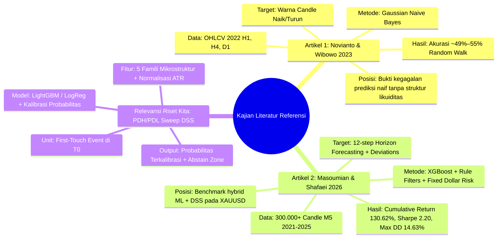
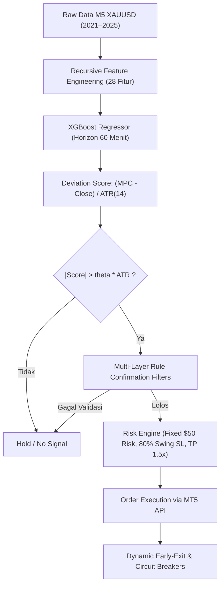
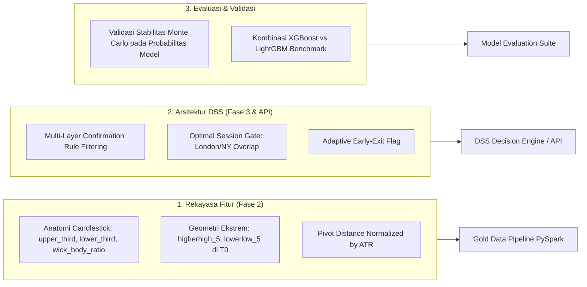

# 16. Kajian Literatur Komprehensif: Analisis Artikel Referensi & Relevansi Implementasi Riset

Dokumen ini memuat analisis kritis, sintesis metodologis, dan pemetaan relevansi implementasi terhadap 2 (dua) artikel penelitian pada direktori `reference/`:
1. **Artikel 1:** Novianto & Wibowo (2023) — *The Implementation of Data Mining for Predicting XAU/USD Price Trends in the Forex Market on Meta Trader 5 using Naïve Bayes Method* (`5852b6578baefe9a45b6229cc6dbc90466d7.pdf`).
2. **Artikel 2:** Masoumian & Shafaei (2026) — *A Hybrid Machine Learning and Rule-Based Decision Support System for Short-Term Trading: A Case Study on XAUUSD* (`ssrn-7279718.pdf`).

---

## 1. Metadata & Ringkasan Eksekutif Artikel Referensi



---

## 2. Bedah Kritis Artikel 1: Novianto & Wibowo (2023)

### 2.1 Ringkasan Studi
- **Judul:** *The Implementation of Data Mining for Predicting XAU/USD Price Trends in the Forex Market on Meta Trader 5 using Naïve Bayes Method*
- **Penulis:** Sendi Novianto, Habib Akbar Wibowo (Universitas Dian Nuswantoro / UDINUS)
- **Publikasi:** Jurnal INTELMATICS, Vol. 3, No. 2, Juli-Desember 2023, Hal. 85–90. (DOI: `10.25105/itm.v3i2.17199`)
- **Tujuan:** Menguji efektivitas algoritma *Gaussian Naive Bayes* (`GaussianNB`) untuk memprediksi arah pergerakan harga instrumen XAU/USD (emas) pada tiga *timeframe* berbeda: Daily (D1), H4, dan H1.
- **Dataset:** Data historis tahun 2022 dari MetaTrader 5 (Broker FBS Demo) dengan ukuran:
  - Daily: 259 baris data
  - H4: 1.547 baris data
  - H1: 5.911 baris data
- **Fitur Masukan:** Nilai absolut mentah *Open, High, Low, Close,* dan *Tick Volume*.
- **Variabel Target:** Biner (`Result` $\in \{0, 1\}$), di mana $1$ jika $\text{Close} > \text{Open}$ (Candle Bullish) dan $0$ jika $\text{Close} < \text{Open}$ (Candle Bearish).
- **Hasil Evaluasi:**
  - Daily: Akurasi Testing = 53,84%, F1-Score = 49,99%
  - H4: Akurasi Testing = 49,03%, F1-Score = 53,52%
  - H1: Akurasi Testing = 49,87%, F1-Score = 55,44%

---

### 2.2 Analisis Kritis & Kelemahan Metodologis
1. **Jebakan *Random Walk* (Target Prediksi Tidak Tepat):**
   - Artikel memprediksi apakah *candle* berikutnya berwarna hijau atau merah secara terus-menerus di setiap *time-step*. Berdasarkan *Efficient Market Hypothesis* (EMH), return instrumen likuid pada interval waktu reguler mendekati *martingale* / *random walk*. Akurasi ~50% yang diperoleh membuktikan bahwa model tidak memiliki *edge* prediktif di atas lemparan koin.
2. **Pelanggaran Non-Stasioneritas (*Raw Price Feature Input*):**
   - Fitur yang dimasukkan adalah harga nominal absolut ($1800, $1825, dst.). Saat harga emas bergerak ke rezim harga baru di luar range data latih, algoritma *GaussianNB* yang mengasumsikan distribusi normal tetap pada harga historis akan mengalami *catastrophic failure*.
3. **Risiko Kebocoran Data & Pembagian Acak (*Random Train/Test Split*):**
   - Menggunakan `train_test_split(80/20)` acak standar pada data deret waktu finansial tanpa *purged walk-forward* berpotensi mencampuradukkan dependensi serial temporal masa depan ke dalam data latih.
4. **Ketiadaan Konteks Pasar (*Market Structure & Liquidity Levels*):**
   - Model mengabaikan lokasi level likuiditas, rezim volatilitas (ATR), waktu sesi pasar (London/NY), dan dinamika momentum.

---

### 2.3 Pelajaran & Posisi Terhadap Riset Kita (*Negative Benchmark*)
> [!NOTE]
> **Nilai Strategis untuk Skripsi:** Artikel Novianto & Wibowo (2023) menjadi **justifikasi akademik kuat (studi kontras)** di BAB I dan BAB II skripsi kita untuk menjelaskan **mengapa pendekatan prediksi candle naif konvensional gagal** dan mengapa riset kita beralih ke:
> 1. **Pemodelan Berbasis Event (*Event-Driven*) pada $T_0$**: Hanya memprediksi saat harga menyentuh level likuiditas kunci (PDH/PDL), bukan di setiap candle acak.
> 2. **Fitur Nir-Dimensi / Stasioner**: Seluruh fitur dinormalisasi menggunakan kelipatan ATR (`atr_ratio`, `adr_used_pct`, `price_vs_ema_atr`) sehingga kebal terhadap pergeseran harga nominal emas.
> 3. **Validasi Ketat *Purged Walk-Forward CV***: Menjamin ketiadaan kebocoran data deret waktu.

---

## 3. Bedah Kritis Artikel 2: Masoumian & Shafaei (2026 / SSRN)

### 3.1 Ringkasan Studi
- **Judul:** *A Hybrid Machine Learning and Rule-Based Decision Support System for Short-Term Trading: A Case Study on XAUUSD*
- **Penulis:** Mohammad Mahdi Masoumian, Rasoul Shafaei (K. N. Toosi University of Technology, Tehran, Iran)
- **Publikasi:** SSRN Working Paper / Preprint (SSRN ID: `7279718`, Februari 2026).
- **Tujuan:** Mengembangkan sistem pendukung keputusan perdagangan jangka pendek (*short-term trading DSS*) hibrida yang menggabungkan model peramalan *XGBoost* dengan filter konfirmasi berbasis aturan (*rule-based filters*) dan manajemen risiko *fixed-dollar risk*.
- **Dataset:** >300.000 candle M5 (5 menit) XAU/USD periode **Januari 2021 s/d Oktober 2025** (data tick broker teregulasi via MT5).
- **Arsitektur Sistem (3 Lapisan):**
  1. **Forecasting Engine (XGBoost):** Memprediksi sekuens 12 candle M5 ke depan (horizon 60 menit) dari 12 candle ke belakang. Membentuk 4 variabel agregat: *Mean Predicted Open/High/Low/Close* (MPO, MPH, MPL, MPC).
  2. **Rule-Based Confirmation Filters:** Matriks *rolling* 3-baris dari 9 indikator teknikal (Trend MA, Candlestick Analysis, Fibonacci/Fractal, Pivot Points, Price Volume Trend, RSI, PSAR, MACD). Filter RSI dan PSAR dibuang karena mendegradasi performa.
  3. **Execution & Risk Management Layer:**
     - Ukuran posisi: *Fixed-dollar-risk* ($50 per transaksi).
     - *Stop-loss*: 80% dari *swing extreme* 5 candle terakhir.
     - *Take-profit*: 1,5 $\times$ jarak risiko (*reward-to-risk* 1.5:1).
     - *Circuit breakers*: Batas rugi harian -$200, target untung harian $400.
     - *Session filter*: Hanya aktif pukul 08:00–20:00 UTC+2 (sesi London & tumpang tindih New York).
     - *Dynamic early-exit*: Menutup posisi segera bila probabilitas pembalikan arah terdeteksi.



---

### 3.2 Kinerja Utama Masoumian & Shafaei (2026)
- **Akurasi Prediksi:** Out-of-Sample RMSE = 2.83 (~283 pips), MAPE = 0.06%.
- **Metrik Finansial Backtest (5.671 Transaksi):**
  - Return Kumulatif: **+130,62%** ($13.062 profit dari modal awal $10.000).
  - *Win Rate*: **43,4%** (tetap profit karena rasio asimetris rata-rata win $43,88 vs loss -$29,57 berkat *dynamic early exit*).
  - *Profit Factor*: **1,14**
  - *Sharpe Ratio*: **2,20**
  - *Maximum Drawdown*: **14,63%**
  - *Recovery Factor*: **15,76**
- **Validasi Ketahanan Monte Carlo (50.000 Iterasi):**
  - Rata-rata return tahunan simulasi: **30,7%**.
  - Probabilitas profit tahunan: **89%**.

---

## 4. Matriks Perbandingan Komparatif Tiga Pendekatan

Berikut adalah perbandingan mendalam antara Artikel 1, Artikel 2, dan Riset Skripsi Kita:

| Dimensi Parameter | Novianto & Wibowo (2023) | Masoumian & Shafaei (2026) | **Riset Skripsi Kita (PDH/PDL DSS)** |
| :--- | :--- | :--- | :--- |
| **Fokus Masalah** | Klasifikasi tren candle berikutnya | Peramalan harga 60-menit + Eksekusi Otomatis | Klasifikasi struktural *Sweep vs Breakout* pada level likuiditas |
| **Instrumen & Timeframe** | XAUUSD (D1, H4, H1) | XAUUSD (M5, horizon 1 jam) | **XAUUSD (Level: D1/W1; Observasi: H1, horizon 6 jam)** |
| **Rentang Waktu Data** | 1 Tahun (2022) | 4,8 Tahun (2021 – Okt 2025) | **10,5 Tahun (1 Jan 2016 – 31 Jul 2026)** |
| **Unit Analisis** | Per candle kontinu (*time-step*) | Per candle kontinu M5 (sliding window 12) | **Per Event Sentuhan Pertama (*First-Touch Event* pada $T_0$)** |
| **Representasi Target** | Biner (0: Bearish, 1: Bullish) | Regresi OHLC 12-step $\rightarrow$ Normalized Score | **4 Kelas Saling Lepas (`IMMEDIATE_SWEEP`, `DELAYED_SWEEP`, `FAILED_SWEEP`, `PURE_BREAKOUT`)** |
| **Rekayasa Fitur** | Tidak ada (Harga mentah OHLCV) | 28 Fitur (MA, Pivot, Volatility, Candle Anatomy, RSI, MACD) | **~40 Fitur (5 Famili: Sesi, Volatilitas ATR, Tren HTF, Geometri Level, Dinamika Pendekatan)** |
| **Normalisasi Fitur** | Tidak ada | Sebagian (normalisasi deviasi berbasis ATR) | **Penuh (Semua fitur dinormalisasi ATR / nir-dimensi)** |
| **Algoritma ML** | Gaussian Naive Bayes (`GaussianNB`) | XGBoost Regressor Ensemble | **Hierarkis (M1/M2): Regresi Logistik Teratur + LightGBM Classifier** |
| **Filosofi Output** | Sinyal biner tanpa kalibrasi | Eksekusi trading otomatis (*Expert Advisor*) | **Sistem Pendukung Keputusan (*DSS*) Probabilistik + *Abstain Zone*** |
| **Protokol Validasi** | Split 80:20 Acak Standar | *Purged Walk-Forward Backtesting* + Monte Carlo (50k run) | ***Purged Expanding Walk-Forward CV* (6 Fold) + Embargo 6-Bar + OOS Terkunci (2025–2026)** |
| **Fokus Evaluasi** | Akurasi & F1-Score Sederhana | Metrik Keuangan (Sharpe, DD, PF, Profit) | **Kalibrasi Probabilitas (Brier Score, ECE), PR-AUC, MCC, SHAP** |

---

## 5. Komponen Relevan yang Dapat Diimplementasikan ke Riset Kita

Berdasarkan analisis kedua artikel di atas, terdapat beberapa inovasi konkret yang dapat diadopsi dan diintegrasikan ke dalam repositori riset kita:



### 5.1 Penambahan Fitur Mikrostruktur Anatomi Candle & Swing Extent (Fase 2)
Dalam Tabel 1 artikel Masoumian (2026), terdapat fitur anatomi *candlestick* dan *swing range* yang sangat relevan untuk ditambahkan ke kamus fitur Gold kita:

1. **Rasio Penolakan Ekor (*Candle Anatomy / Shadow Ratios*):**
   - `upper_wick_ratio_atr` $= \frac{\text{High}_{T_0} - \max(\text{Open}_{T_0}, \text{Close}_{T_0})}{\text{ATR}_{14}}$
   - `lower_wick_ratio_atr` $= \frac{\min(\text{Open}_{T_0}, \text{Close}_{T_0}) - \text{Low}_{T_0}}{\text{ATR}_{14}}$
   - *Hipotesis:* Saat menyentuh PDH, `upper_wick_ratio_atr` yang tinggi pada candle $T_0$ mengindikasikan penolakan likuiditas instan (*Immediate Sweep*).

2. **Ekstrem Ayunan 5-Bar (*5-Bar Swing Extent*):**
   - `swing_5_range_atr` $= \frac{\max(\text{High}_{T_{-4} \dots T_0}) - \min(\text{Low}_{T_{-4} \dots T_0})}{\text{ATR}_{14}}$
   - *Hipotesis:* Jangkauan ayunan 5 candle sebelum menyentuh level mengukur seberapa terentangnya pergerakan sebelum menembus PDH/PDL.

3. **Jarak Relatif Terhadap Pivot (*Pivot Proximity Indicator*):**
   - `diff_pivot_atr` $= \frac{\text{Price}_{T_0} - \text{Daily Pivot}}{\text{ATR}_{14}}$

---

### 5.2 Formulasi Aturan Filter Konfirmasi untuk Lapisan DSS (*Rule-Based Gating*)
Masoumian (2026) membuktikan bahwa model ML murni menjadi jauh lebih tangguh saat digabungkan dengan lapisan filter berbasis aturan (*rule-based confirmation*). Pada DSS kita, ini dapat diimplementasikan sebagai **Lapisan Kebijakan Rekomendasi (*Recommendation Policy Layer*)**:

```python
def evaluate_dss_decision(p_sweep, p_breakout, features):
    """
    Evaluasi probabilitas ML dengan konteks filter pasar (Hybrid DSS)
    """
    # 1. Cek Zona Abstain Dasar
    if abs(p_sweep - p_breakout) < 0.15 or (0.42 <= p_sweep <= 0.58):
        return {
            "status": "ABSTAIN",
            "confidence": "LOW",
            "reason": "Probabilitas berada dalam zona netral/ambigu."
        }
    
    # 2. Filter Rezim Sesi (Temuan Masoumian 2026: Sesi Asia rawan noise/false signal)
    if features["session"] == "ASIA" and p_breakout > 0.60:
        return {
            "status": "ABSTAIN_SESSION",
            "confidence": "MODERATE",
            "reason": "Probabilitas Breakout tinggi namun terdeteksi pada Sesi Asia (likuiditas rendah, rawan fakeout)."
        }
    
    # 3. Filter Kejenuhan ADR (ADR Used Pct > 90%)
    if features["adr_used_pct"] > 0.90 and p_breakout > 0.60:
        return {
            "status": "CAUTION_EXHAUSTION",
            "confidence": "LOW",
            "reason": "Rentang harian (ADR) sudah terpakai >90%. Probabilitas continuation breakout berisiko tinggi."
        }
    
    # 4. Sinyal Solid Terkonfirmasi
    if p_sweep >= 0.65 and features["session"] in ["LONDON", "NY"]:
        return {
            "status": "STRONG_SWEEP",
            "confidence": "HIGH",
            "p_calibrated": round(p_sweep, 4),
            "dominant_driver": "London/NY High Volume + Liquidity Rejection"
        }
        
    return {
        "status": "LEAN_SWEEP" if p_sweep > p_breakout else "LEAN_BREAKOUT",
        "confidence": "MODERATE",
        "p_calibrated": round(max(p_sweep, p_breakout), 4)
    }
```

---

### 5.3 Implementasi Tambahan: Uji Ketahanan Monte Carlo pada Output DSS
Masoumian (2026) menggunakan 50.000 iterasi Monte Carlo untuk membuktikan ketahanan sistem. Untuk riset skripsi kita, kita dapat mengadaptasi konsep ini sebagai **Monte Carlo Calibration Stability Test**:
- Menguji distribusi kalibrasi probabilitas dan stabilitas *Expected Calibration Error* (ECE) di bawah *bootstrapping* 10.000 sub-sampel acak pada set OOS.

---

## 6. Panduan Integrasi ke Draft Proposal & Naskah Skripsi

Kedua artikel ini dapat langsung diintegrasikan ke dalam dokumen draft proposal skripsi ([`docs/08_draft_proposal_skripsi.md`](./08_draft_proposal_skripsi.md)):

### 6.1 Usulan Teks untuk BAB I (Latar Belakang & Identifikasi Masalah)
```markdown
Upaya pemodelan pergerakan harga instrumen XAUUSD menggunakan teknik data mining telah diteliti sebelumnya oleh Novianto dan Wibowo (2023) menggunakan algoritma Naïve Bayes pada data tahun 2022. Namun, penelitian tersebut hanya memprediksi arah candle kontinu per-satuan waktu dengan fitur harga mentah tanpa memperhitungkan struktur likuiditas pasar, sehingga menghasilkan akurasi yang mendekati probabilitas acak (~49%–53%). Di sisi lain, studi terbaru oleh Masoumian dan Shafaei (2026) menunjukkan bahwa pemodelan XAUUSD jangka pendek membutuhkan rekayasa fitur berbasis volatilitas (ATR), identifikasi zona sesi likuiditas tinggi (tumpang tindih London-New York), dan integrasi filter aturan kontekstual untuk mencapai keputusan yang andal. Mengacu pada perkembangan tersebut, penelitian ini memformulasikan masalah bukan sebagai peramalan harga kontinu, melainkan sebagai klasifikasi probabilistik terkalibrasi pada momen kritis sentuhan pertama level likuiditas harian (PDH/PDL).
```

### 6.2 Usulan Teks untuk BAB II (Tinjauan Pustaka & Posisi Penelitian)
```markdown
### 2.3 Studi Terkait dan Pemosisian Penelitian

1. **Novianto dan Wibowo (2023)** meneliti klasifikasi arah tren harga XAUUSD menggunakan Gaussian Naïve Bayes pada tiga timeframe (D1, H4, H1). Hasil penelitian menunjukkan performa F1-score sebesar 49,99% (D1), 53,52% (H4), dan 55,44% (H1). Rendahnya performa tersebut mengonfirmasi keterbatasan prediksi deret waktu finansial yang mengandalkan harga nominal absolut tanpa normalisasi stasioner dan tanpa penjangkaran pada level likuiditas struktural.
2. **Masoumian dan Shafaei (2026)** merancang sistem pendukung keputusan hibrida berbasis ensemble XGBoost dan filter konfirmasi aturan pada 300.000+ data 5-menit XAUUSD (2021–2025). Penelitian tersebut berhasil mendemonstrasikan bahwa integrasi normalisasi deviasi harga berbasis ATR, pembatasan jendela perdagangan pada sesi aktif London-New York, serta validasi purged walk-forward menghasilkan performa prediktif out-of-sample yang stabil (MAPE 0,06%).

Penelitian ini memosisikan diri secara unik dengan menggabungkan keunggulan representasi stasioner dan validasi purged walk-forward dari literatur mutakhir, namun memfokuskan unit analisis secara spesifik pada level likuiditas institusional (PDH/PDL) dengan target klasifikasi 4-kelas yang saling lepas dan sistem inferensi probabilistik berzona abstain.
```

---

## 7. Kesimpulan & Langkah Tindak Lanjut

1. **Validitas Konsep Terkonfirmasi:** Analisis terhadap artikel Masoumian & Shafaei (2026) memvalidasi penuh keputusan arsitektur riset kita, khususnya penggunaan *Purged Walk-Forward CV*, normalisasi fitur dengan ATR, perlakuan khusus terhadap sesi London/NY, dan penerapan pendekatan hibrida ML + filter kontekstual.
2. **Justifikasi Ilmiah Kuat:** Artikel Novianto & Wibowo (2023) memperkaya kajian pustaka sebagai studi pembanding empiris yang menjelaskan kegagalan prediksi naif.
3. **Peningkatan Fitur:** Tiga fitur baru (*Candle Anatomy Ratios*, *5-bar Swing Extent*, dan *Pivot Distance*) siap ditambahkan ke dalam skrip rekayasa fitur PySpark Gold layer.
