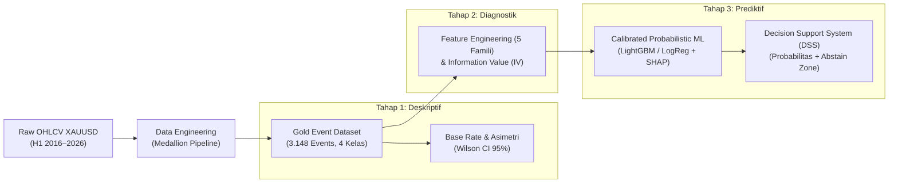

# Dokumentasi Riset: Sistem Pendukung Keputusan Klasifikasi Liquidity Sweep vs Breakout XAUUSD

Dokumentasi ini merupakan repositori komprehensif seluruh ide, landasan teoretis, arsitektur data engineering, metodologi analitik 3-fase, catatan audit/review, dan naskah proposal skripsi untuk penelitian:
**"Sistem Pendukung Keputusan Klasifikasi *Liquidity Sweep* dan *Breakout* pada Level Likuiditas PDH/PDL Instrumen XAUUSD Menggunakan *Machine Learning*"**.

---

## 🗺️ Peta Navigasi Dokumentasi (`docs/`)

| File Dokumen | Topik & Cakupan Utama | Rujukan Terkait |
| :--- | :--- | :--- |
| [**`00_base_knowledge.md`**](./00_base_knowledge.md) | **Fondasi Pengetahuan Dasar**: Konsep pasar XAUUSD, anatomi *candlestick*, definisi likuiditas PDH/PDL & PWH/PWL, multi-timeframe (H1, H4, D1), dan karakteristik sesi trading. | *Base Knowledge* |
| [**`01_arsitektur_dan_ide_riset.md`**](./01_arsitektur_dan_ide_riset.md) | **Visi & Desain Riset**: Latar belakang masalah subjektivitas trader, arsitektur pemodelan 3-fase (Deskriptif $\rightarrow$ Diagnostik $\rightarrow$ Prediktif), dan pembatasan ruang lingkup. | *Idea Riset* |
| [**`02_decision_log.md`**](./02_decision_log.md) | **Catatan Keputusan Metodologis**: Uji empiris pra-registrasi penentuan periode data (2016–2026), stabilitas fitur (PSI & normalisasi ATR), dan evolusi skema validasi (*Purged Expanding Walk-Forward CV*). | *Decision Log* |
| [**`03_data_engineering_medallion.md`**](./03_data_engineering_medallion.md) | **Pipeline Data Engineering (Databricks/PySpark)**: Arsitektur Medallion (*Bronze* $\rightarrow$ *Silver* $\rightarrow$ *Gold*), penanganan zona waktu 17:00 NY, aturan invarian T1–T14, dan gerbang kualitas data (*DQ Funnel*). | *Data Engineering Databricks* |
| [**`04_fase_1_deskriptif.md`**](./04_fase_1_deskriptif.md) | **Fase 1 — Analitik Deskriptif**: Menjawab RM1 (*"Seberapa sering?"*), inventarisasi 3.148 event, estimasi *base rate* (metode Wilson), asimetri PDH vs PDL, dan analisis sebaran skenario pasar. | *Tingkat Deskriptif (D1–D7)* |
| [**`05_fase_2_diagnostik.md`**](./05_fase_2_diagnostik.md) | **Fase 2 — Analitik Diagnostik**: Menjawab RM2 (*"Dalam kondisi apa?"*), pustaka ~40 fitur kandidat dalam 5 famili, audit *point-in-time*, Information Value (IV), reduksi redundansi, dan koreksi Benjamini-Hochberg FDR. | *Tingkat Diagnostik (G1–G6)* |
| [**`06_fase_3_prediktif_dss.md`**](./06_fase_3_prediktif_dss.md) | **Fase 3 — Pemodelan Prediktif & DSS**: Menjawab RM3 (*"Berapa probabilitasnya sekarang?"*), formalisasi ML task, arsitektur model hierarkis (M1/M2), baseline berjenjang B0–B2, kalibrasi probabilitas (ECE/Brier), dan kebijakan *abstain zone*. | *Tingkat Prediktif (P1–P9)* |
| [**`07_catatan_review_dan_perbaikan_desain.md`**](./07_catatan_review_dan_perbaikan_desain.md) | **Audit Desain & Catatan Review Kritis V1**: Evaluasi matematis temuan kritis T1–T14 (perbaikan formula Boolean target sweep, eliminasi kebocoran batas akhir pekan/sesi, validasi one-hot outcome). | *Catatan Review V1* |
| [**`08_draft_proposal_skripsi.md`**](./08_draft_proposal_skripsi.md) | **Naskah Lengkap Draft Proposal Skripsi**: Dokumen formal BAB I (Pendahuluan), BAB II (Tinjauan Pustaka & Landasan Mikrostruktur), dan BAB III (Metodologi Penelitian) tervalidasi per 16 Agustus 2026. | *[DRAFT] PROPOSAL* |
| [**`09_implementasi_script_medallion.md`**](./09_implementasi_script_medallion.md) | **Implementasi PySpark (Medallion)**: Panduan langkah per langkah dari skrip Databricks (Bronze, Silver, Gold), konversi zona waktu 17:00 NY, dan pembuatan fitur *window lead*. | *Skrip Databricks* |
| [**`10_glosarium_dan_identitas_data.md`**](./10_glosarium_dan_identitas_data.md) | **Glosarium Konsep & Profil Data**: Rangkuman identitas data H1, penjelasan konsep *Liquidity Sweep* vs *Pure Breakout*, serta makna Aturan Invarian T1-T14. | *Glosarium* |
| [**`11_algoritma_machine_learning.md`**](./11_algoritma_machine_learning.md) | **Pengenalan Algoritma ML**: Penjelasan sederhana dengan analogi mengenai konsep *Gradient Boosting*, serta perbandingan spesifik antara algoritma XGBoost dan LightGBM. | *Konsep ML* |
| [**`12_alur_evaluasi_model_ml.md`**](./12_alur_evaluasi_model_ml.md) | **Alur Evaluasi Machine Learning**: Penjelasan pembagian tahun data (*Purged Walk-Forward*), tiga metrik kalibrasi probabilitas kelas berat, dan konsep operasional *Abstain Zone* pada DSS. | *Alur Evaluasi* |
| [**`13_alur_proses_training_ml.md`**](./13_alur_proses_training_ml.md) | **Alur dan *Tech Stack* Training ML**: Panduan 6 langkah operasional pelatihan model (dari penarikan data hingga *logging* di MLflow) beserta penjelasan daftar pustaka (*library*) Python yang dipakai. | *Proses Training* |
- [14. Kamus Data Gold (Data Dictionary)](14_kamus_data_gold.md)
- [15. Laporan Komprehensif: Rekayasa Fitur, Teori Statistik & ML (DSS)](15_laporan_komprehensif_pemodelan_ml.md)
- [15. Plan: Implementasi API DSS](plans/02_api_implementation_plan.md)

---

## 🎯 Intisari Masalah & Pendekatan Riset

### 1. Masalah Utama
Seorang trader teknikal mengetahui bahwa harga sering bereaksi di level likuiditas (*Previous Day High/Low* - PDH/PDL), namun penentuan apakah harga akan mengalami **Sweep** (pembalikan arah/reversal) atau **Breakout** (kelanjutan tren/continuation) selama ini dilakukan secara **subjektif, intuitif, dan tidak dapat direproduksi**.

### 2. Solusi yang Ditawarkan
Membangun **Sistem Pendukung Keputusan (DSS)** berbasis Machine Learning yang:
1. **Mengubah data kontinu OHLCV menjadi dataset event terstruktur** berbasis sentuhan pertama (*first-touch event*).
2. **Mengelompokkan outcome ke dalam 4 kelas saling lepas**: `IMMEDIATE_SWEEP`, `DELAYED_SWEEP`, `FAILED_SWEEP`, dan `PURE_BREAKOUT`.
3. **Mengestimasi probabilitas terkalibrasi** untuk setiap kejadian disertai **zona abstain** (tidak mengambil keputusan saat model tidak yakin), bukan sinyal biner deterministik atau robot trading otomatis.

---

## 🔬 Spesifikasi Kunci Penelitian

- **Instrumen:** Emas Spot Dunia vs US Dollar (`XAUUSD` / `GOLD`).
- **Timeframe Analisis:** 
  - Level Acuan: **Daily (D1)** untuk PDH/PDL; **Weekly (W1)** untuk PWH/PWL.
  - Timeframe Observasi Eksekusi: **Hourly (H1)**.
  - Jendela Evaluasi ($N$): **6 Candle H1** (mewakili 1 sesi penuh London / NY).
- **Periode Data:** **1 Januari 2016 s/d 31 Juli 2026** (10,5 tahun, 3.148 event first-touch).
- **Skema Validasi:** *Purged Expanding Walk-Forward Cross-Validation* dengan *Embargo* 6 candle (Val 2019 $\rightarrow$ 2024; OOS terkunci: 2025–Jul 2026).
- **Teknologi Utama:** Databricks, Apache Spark / PySpark, Delta Lake, Python (Scikit-Learn, LightGBM, SHAP).
