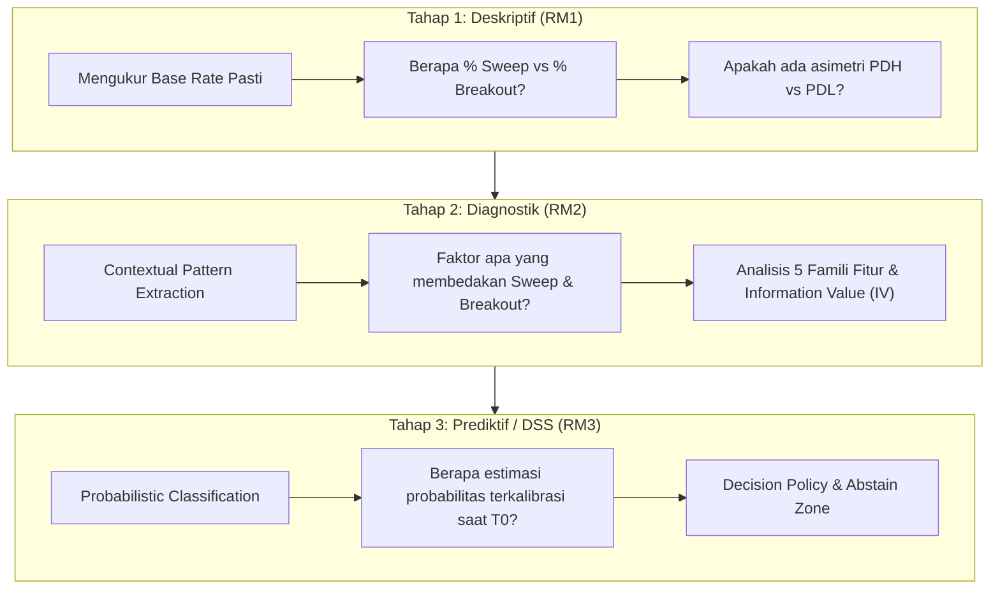

# 01. Arsitektur dan Ide Riset

Dokumen ini merangkum perumusan masalah, arsitektur analitik 3-tahap, landasan perancangan jendela observasi, dan definisi operasional variabel target pada penelitian Sistem Pendukung Keputusan Liquidity Sweep vs Breakout XAUUSD.

---

## 1. Latar Belakang & Perumusan Masalah

### 1.1 Masalah Utama (Problem Statement)
Dalam perdagangan komoditas emas (XAUUSD), level harga tertinggi dan terendah hari sebelumnya (*Previous Day High/Low* - PDH/PDL) merupakan area konsentrasi likuiditas tempat para pelaku pasar meletakkan order *stop-loss* dan *pending orders*. 

Ketika harga menyentuh dan menembus level tersebut, terdapat dua kemungkinan struktural utama:
1. **Liquidity Sweep (Reversal):** Harga menembus level secara sementara untuk mengambil likuiditas, namun segera ditolak dan berbalik kembali ke dalam rentang sebelumnya.
2. **Breakout (Continuation):** Penembusan harga berlanjut secara agresif dan harga berhasil menetap (*close*) di luar rentang.

```text
[Kondisi: Penembusan PDH (Level Atas)]

       LIQUIDITY SWEEP (Reversal)                      BREAKOUT (Continuation)
       --------------------------                      -----------------------
               ^ [High Spike / Wick]                                 === [Close di Luar]
               |                                                     |
       ========+========= PDH (Level)                 ===============+======== PDH (Level)
               |                                                     |
           === + === [Close di Dalam]                            === + === [Open di Dalam]
```

**Kelemahan Praktik Saat Ini:**
Pengambilan keputusan untuk menentukan apakah suatu penembusan adalah *Sweep* atau *Breakout* masih dilakukan secara **sangat intuitif, subjektif, dan tidak dapat direproduksi**, karena data mentah *Open-High-Low-Close-Volume* (OHLCV) belum diformalkan menjadi matriks keputusan probabilistik yang terukur.

---

## 2. Struktur Tiga Rumusan Masalah (RM) dan Tiga Tahap Riset

Riset ini dirancang secara modular dan berjenjang dalam 3 tahap analitik:



| Tahap Analitik | Pertanyaan Kunci | Rumusan Masalah (RM) | Luaran Konkret |
| :--- | :--- | :--- | :--- |
| **1. Deskriptif** | *"Seberapa sering?"* | **RM1:** Berapa proporsi pasti kejadian *sweep* dibandingkan *breakout*, dan apakah ada asimetri antara PDH dan PDL? | *Base rate* terukur + Selang Kepercayaan (CI 95% Wilson) + Inventarisasi 3.148 event. |
| **2. Diagnostik** | *"Dalam kondisi apa?"* | **RM2:** Faktor kontekstual apa (sesi, volatilitas, tren, geometri level, dinamika pendekatan) yang secara statistik membedakan kedua kejadian? | Pustaka ~40 fitur teruji, peringkat Information Value (IV), matriks korelasi, dan aturan interaksi. |
| **3. Prediktif** | *"Berapa probabilitasnya sekarang?"* | **RM3:** Sejauh mana model Machine Learning mampu mengestimasi probabilitas *sweep* vs *breakout* secara terkalibrasi dan mengungguli garis dasar (*baseline*)? | Model klasifikasi (LightGBM/LogReg), kurva kalibrasi, skor Brier/ECE, atribusi SHAP, dan prototipe DSS dengan *abstain zone*. |

---

## 3. Sumber Data dan Provenans

- **Penyedia Data:** Blue Capital Trading ([Free Historical Data](https://www.bluecapitaltrading.com/products/free-historical-data/)).
- **Folder Unduhan Data:** [Google Drive Repository (H1/H4/D1)](https://drive.google.com/drive/folders/1gzimRHJH65las65FLHz56eJtPGCz0s5o?usp=sharing).
- **Format:** CSV mentah OHLCV XAUUSD (Tick volume).
- **Periode Terpilih:** **1 Januari 2016 s/d 31 Juli 2026** (10,5 tahun data kontinu, 2.560 event Daily, total 3.148 event Daily+Weekly).
- **Historical Robustness Set:** Data 2010–2015 disimpan secara independen untuk uji ketahanan di luar sampel historis.

---

## 4. Parameter Jendela Observasi & Unit Analisis

| Parameter | Nilai Penetapan | Justifikasi Metodologis |
| :--- | :--- | :--- |
| **Unit Analisis** | *First-Touch Event* (`touch_rank = 1`) | Menghindari bias autokorelasi dari *multiple re-tests* pada hari/pekan yang sama (*Level Exhaustion Rule*). |
| **Level Acuan** | Daily ($D-1$) & Weekly ($W-1$) | Titik konsentrasi likuiditas institusional yang paling valid secara teoritis. |
| **Timeframe Observasi** | **H1 (Hourly)** | Menyaring noise sub-hourly (M1–M15) namun tetap menangkap dinamika intraday secara presisi. |
| **Jendela Evaluasi ($N$)** | **6 Candle H1 (6 Jam)** | Merangkum durasi 1 sesi penuh pasar utama (London atau New York), cukup untuk menilai retensi penolakan harga. |
| **Batas Hari Sesi** | **17:00 New York (Eastern Time)** | Menghilangkan anomali candle Minggu dan menyelaraskan siklus pasar FX/Gold global. |

---

## 5. Definisi Operasional Variabel Target (`outcome` 4 Kelas)

Variabel target dibangun secara mekanis dari **dua predikat Boolean dasar** yang dievaluasi pada harga penutupan (*Close*) candle H1:

$$\begin{aligned}
\text{returned\_early} &= (C_{t+1} \le \text{Level}) \lor (C_{t+2} \le \text{Level}) \quad \text{[untuk level High]} \\
\text{ended\_inside}   &= (C_{t+6} \le \text{Level}) \quad \text{[untuk level High]}
\end{aligned}$$
*(Catatan: untuk level Low/PDL/PWL, tanda pertidaksamaan dibalik menjadi $\ge$)*.

Kombinasi kedua predikat menghasilkan matriks 4 kelas yang **saling lepas (*mutually exclusive*) dan tuntas (*collectively exhaustive*)**:

| Matriks Klasifikasi | `ended_inside = True` (Berakhir di Dalam $\rightarrow$ **SWEEP**) | `ended_inside = False` (Berakhir di Luar $\rightarrow$ **BREAKOUT**) |
| :--- | :--- | :--- |
| **`returned_early = True`**<br>*(Reaksi Cepat Candle 1–2)* | **`IMMEDIATE_SWEEP`**<br>Harga ditolak cepat pada 2 jam pertama dan tetap bertahan di dalam rentang hingga candle ke-6. | **`FAILED_SWEEP`** *(Reversal Trap)*<br>Harga sempat bereaksi masuk pada awal penembusan, namun gagal mempertahankan pembalikan dan akhirnya tetap tembus di luar rentang. **Jebakan termahal bagi trader.** |
| **`returned_early = False`**<br>*(Tanpa Reaksi Cepat)* | **`DELAYED_SWEEP`**<br>Harga sempat tertahan di luar rentang pada candle 1–2, baru kemudian ditarik masuk kembali dan ditutup di dalam rentang pada candle ke-6. | **`PURE_BREAKOUT`**<br>Harga menembus level dan secara konsisten bergerak menjauh tanpa pernah kembali ke dalam rentang sepanjang 6 candle. |

```python
# Formula Logika PySpark (Medallion Gold Layer)
outcome_col = (
    F.when( F.col("returned_early") &  F.col("ended_inside"), F.lit("IMMEDIATE_SWEEP"))
     .when(~F.col("returned_early") &  F.col("ended_inside"), F.lit("DELAYED_SWEEP"))
     .when( F.col("returned_early") & ~F.col("ended_inside"), F.lit("FAILED_SWEEP"))
     .when(~F.col("returned_early") & ~F.col("ended_inside"), F.lit("PURE_BREAKOUT"))
     .otherwise(F.lit(None)) # Sentinel di-assert 0 pada validasi
)
```

---

## 6. Batasan dan Pernyataan Etis Riset

> [!IMPORTANT]
> **Pernyataan Batasan Masalah & Etika Penelitian**
> 1. **Bukan Robot Trading / Advisory:** Riset ini murni bertujuan akademis untuk mengevaluasi sifat struktural likuiditas pasar. Luaran yang dihasilkan adalah prototipe **Sistem Pendukung Keputusan**, bukan *Expert Advisor* (EA) otomatis dan bukan saran investasi finansial.
> 2. **Evaluasi Statistik, Bukan Simulasi Finansial:** Evaluasi model berfokus pada **akurasi probabilistik, kalibrasi skor (ECE/Brier Score), PR-AUC, dan Matthews Correlation Coefficient (MCC)**. Faktor *spread*, *slippage*, komisi broker, dan eksekusi latensi berada di luar cakupan penelitian.
