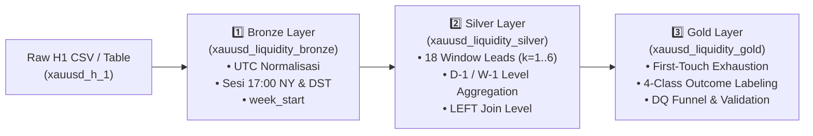

# 03. Data Engineering: Pipeline Medallion PySpark di Databricks

Dokumen ini mendokumentasikan secara teknis arsitektur rekayasa data (*Data Engineering*) berbasis arsitektur **Medallion (Bronze $\rightarrow$ Silver $\rightarrow$ Gold)** di atas Apache Spark / Delta Lake pada Databricks Serverless, aturan invarian kualitas data (T1–T14), dan skema dataset Gold.

---

## 1. Arsitektur Medallion 3-Tahap

Pipeline data engineering mengubah data OHLCV mentah XAUUSD timeframe H1 menjadi dataset event likuiditas terstruktur berlabel pada level **PDH, PDL, PWH, dan PWL**.



### 1.1 Rationale Kinerja: Mengapa Dipecah Menjadi 3 Tahap?
Pada desain monolitik awal (*single unified DAG*), eksekusi PySpark mengalami degradasi performa berat:
1. **Lineage Explosion:** Eksekusi puluhan perintah evaluasi `.count()` (pada tripwire, funnel, dan asersi) memaksa Spark menghitung ulang seluruh rantai komputasi dari awal, termasuk 18 operasi window `lead()`.
2. **Duplikasi Komputasi:** DataFrame perantara dievaluasi 4 kali (sekali untuk masing-masing level: PDH, PDL, PWH, PWL).
3. **Solusi Pemutus Lineage (*Lineage Breaker*):** Menulis hasil tiap tahap ke **Tabel Delta Lake** (`mode("overwrite")`) memutus rantai ketergantungan graf DAG. Setiap tahap hanya dihitung sekali. Saat mengiterasi logika pelabelan, rekayasa ulang cukup dijalankan pada tahap **Gold** tanpa mengulang Bronze dan Silver.

---

## 2. Rincian Teknis Tiap Tahap Medallion

### 2.1 Tahap 1 — Bronze: Normalisasi & Penyelarasan Sesi Finansial (`liquidity_1_bronze_H1.py`)
- **Input:** `market.default.xauusd_h_1`
- **Output:** `market.default.xauusd_liquidity_bronze`

**Transformasi Utama:**
1. Validasi timestamp unik (tidak ada duplikasi baris).
2. Filter rentang data: `timestamp >= 2016-01-01`.
3. **Perhitungan `session_date` (Batas 17:00 NY):**
   ```python
   # UTC -> Waktu New York -> Geser +7 Jam -> Ambil Tanggal Sesi
   SESSION_TZ = "America/New_York"
   SESSION_SHIFT_HOURS = 7 # 24 - 17
   
   ny_time = F.from_utc_timestamp(F.col("timestamp"), SESSION_TZ)
   df = df.withColumn(
       "session_date",
       F.to_date(ny_time + F.expr(f"INTERVAL {SESSION_SHIFT_HOURS} HOURS"))
   )
   ```
4. **Penentuan Sesi Pasar:** Berbasis zona waktu (`ASIA`, `LONDON`, `NY`, `OFF_SESSION`), sadar pergeseran DST.
5. **Kunci Pekan:** `week_start = date_trunc("week", session_date)` (Senin).

**Tripwire Bronze:** Hari perdagangan utuh ($\ge 12$ candle H1), tidak jatuh pada hari Sabtu kalender lokal, candle Minggu UTC otomatis dilabeli sesi Senin.

---

### 2.2 Tahap 2 — Silver: Window Lead & Agregasi Level H-1 / W-1 (`liquidity_2_silver_H1.py`)
- **Input:** `market.default.xauusd_liquidity_bronze`
- **Output:** `market.default.xauusd_liquidity_silver`

**Transformasi Utama:**
1. **Window Leads Global ($k = 1..6$):** Dihitung pada urutan waktu global *sebelum* join untuk menjamin integritas urutan candle:
   ```python
   w_global = Window.orderBy("timestamp")
   for k in range(1, 7):
       df = df.withColumn(f"close_lead_{k}", F.lead("close", k).over(w_global)) \
              .withColumn(f"high_lead_{k}",  F.lead("high",  k).over(w_global)) \
              .withColumn(f"low_lead_{k}",   F.lead("low",   k).over(w_global))
   df = df.withColumn("ts_lead_6", F.lead("timestamp", 6).over(w_global))
   ```
2. **Agregasi Level Harian (PDH/PDL) dari Data H1:**
   Level dihitung dari agregasi H1 sesi kemarin via `lag(1)` atas `session_date` (bukan dari tabel D1 broker yang rentan beda definisi batas hari).
3. **Agregasi Level Mingguan (PWH/PWL) dari Data H1:**
   Level dihitung dari agregasi H1 pekan kemarin via `lag(1)` atas `week_start`.
4. **LEFT Join Level ke Candle H1:** Mempertahankan baris tanpa level (*orphan*) untuk dicatat transparan di funnel audit (T6).

---

### 2.3 Tahap 3 — Gold: Deteksi Crossover, Exhaustion & Pelabelan Target (`liquidity_3_gold_H1.py`)
- **Input:** `market.default.xauusd_liquidity_silver`
- **Output:** `market.default.xauusd_liquidity_gold`, `market.default.xauusd_liquidity_dq_funnel`, dan CSV export.

**Transformasi Utama:**
1. **Deteksi Crossover Presisi:**
   - Level High (PDH/PWH): `(prev_high <= level_price) AND (high > level_price)`.
   - Level Low (PDL/PWL): `(prev_low >= level_price) AND (low < level_price)`.
2. **Level Exhaustion (*First-Touch Rule*):**
   Memfilter hanya sentuhan pertama dalam siklus hidup level menggunakan window partition:
   ```python
   # Daily dipartisi per (session_date, level_type), Weekly per (week_start, level_type)
   w_exhaust = Window.partitionBy("session_date", "level_type").orderBy("timestamp")
   df_first = df.withColumn("touch_rank", F.row_number().over(w_exhaust)) \
                .filter(F.col("touch_rank") == 1)
   ```
3. **Filter Jendela Lengkap (T2):** Membuang baris yang `close_lead_6 IS NULL` (hanya di ujung akhir dataset, diterapkan **setelah** exhaustion).
4. **Penanda Kontinuitas Jendela (T3):** 
   `window_is_continuous = (window_hours <= 8.0)` (0 jika menembus libur akhir pekan).
5. **Pelabelan Matriks Target 4 Kelas (T1):**
   Evaluasi predikat `returned_early` dan `ended_inside` menghasilkan kelas: `IMMEDIATE_SWEEP`, `DELAYED_SWEEP`, `FAILED_SWEEP`, `PURE_BREAKOUT`.

---

## 3. Glosarium Aturan Invarian Kualitas Data (T1 – T14)

| Kode | Nama Aturan | Definisi Operasional & Penanganan |
| :---: | :--- | :--- |
| **T1** | **One-Hot & Mutual Exclusivity** | Kolom `outcome` memiliki tepat 4 kelas saling lepas; cabang `otherwise(None)` di-assert bernilai 0. |
| **T2** | **Filter Ujung Dataset** | Filter `close_lead_6 NOT NULL` dieksekusi **setelah** aturan level exhaustion agar tidak mencemari event sah di akhir data. |
| **T3** | **Penanda Akhir Pekan** | Jendela yang melompati akhir pekan ditandai `window_is_continuous = 0` (1,53% event), dieksklusi pada analisis magnitudo tapi dipertahankan pada klasifikasi. |
| **T4** | **DST-Aware Timezone** | Label sesi dihitung dinamis menggunakan fungsi zona waktu astronomis, bukan offset jam statis. |
| **T5** | **Anti-Leakage Validation** | Pembagian data wajib menggunakan *Purged Expanding Walk-Forward CV* dengan jeda *Embargo* 6 candle. |
| **T6** | **Transparent Join** | Penggunaan `LEFT JOIN` pada pelekatan level agar baris H1 tanpa level tercatat di funnel audit dan tidak hilang diam-diam. |
| **T7** | **Gap Open Handling** | Penandaan khusus untuk event yang terjadi akibat lonjakan *gap* harga pada pembukaan pasar. |
| **T8** | **Tick Volume Limitation** | Pelabelan volume secara eksplisit sebagai *Tick Volume* dalam kamus fitur. |
| **T9** | **Single Source Level** | Level PDH/PDL diagregasi mandiri dari data H1 sumber tunggal untuk menjamin keselarasan 99,98%. |
| **T10** | **Statistical Boundary** | Evaluasi model dibatasi pada performa statistik probabilitas dan kalibrasi (bukan simulasi finansial). |
| **T11** | **Diagnostic Completeness** | Tahap diagnostik diformalkan penuh dalam 5 famili fitur dan uji signifikansi FDR. |
| **T12** | **Monotonic Week Key** | Kunci pekan diturunkan seragam dari `date_trunc("week", session_date)`. |
| **T12c**| **Sunday Session Alignment** | Candle Minggu malam waktu NY (UTC malam) terasosiasi ke sesi perdagangan hari Senin. |
| **T13** | **17:00 NY Day Boundary** | Pergantian hari trading dipatok pada penutupan pasar New York (17:00 ET). |
| **T14** | **Session Crossing Audit** | Jendela observasi yang melewati batas sesi harian ditandai pada kolom `crosses_session_boundary` (8,90% event). |

---

## 4. Skema Kolom Tabel Gold (`market.default.xauusd_liquidity_gold`)

| Nama Kolom | Tipe Data | Deskripsi & Peran |
| :--- | :--- | :--- |
| `event_id` | `StringType` | Identifikator unik event (misal: `EVT_PDH_20230510_1400`) |
| `timestamp` | `TimestampType` | Waktu candle crossover $T_0$ dalam zona waktu UTC |
| `session_date` | `DateType` | Tanggal hari sesi trading (berdasarkan batas 17:00 NY) |
| `week_start` | `TimestampType` | Waktu Senin awal pekan terkait |
| `session` | `StringType` | Sesi pasar saat $T_0$ (`ASIA`, `LONDON`, `NY`, `OFF_SESSION`) |
| `level_type` | `StringType` | Tipe level likuiditas (`PDH`, `PDL`, `PWH`, `PWL`) |
| `level_price` | `DoubleType` | Nilai harga pasti dari level yang disentuh |
| `outcome` | `StringType` | **Variabel Target Utama (4 Kelas)** |
| `is_sweep` | `IntegerType` | Target biner (1 jika `ended_inside`, 0 jika breakout) |
| `is_immediate_sweep` | `IntegerType` | One-hot penanda kelas `IMMEDIATE_SWEEP` |
| `is_delayed_sweep` | `IntegerType` | One-hot penanda kelas `DELAYED_SWEEP` |
| `is_failed_sweep` | `IntegerType` | One-hot penanda kelas `FAILED_SWEEP` |
| `is_pure_breakout` | `IntegerType` | One-hot penanda kelas `PURE_BREAKOUT` |
| `returned_early` | `BooleanType` | Predikat audit: *close* kembali ke dalam rentang pada candle 1–2 |
| `ended_inside` | `BooleanType` | Predikat audit: *close* di dalam rentang pada candle ke-6 |
| `close_lead_1` s/d `6` | `DoubleType` | Kolom audit harga *Close* pada horizon $t+1$ s/d $t+6$ |
| `high_lead_1` s/d `6` | `DoubleType` | Kolom audit harga *High* pada horizon $t+1$ s/d $t+6$ |
| `low_lead_1` s/d `6` | `DoubleType` | Kolom audit harga *Low* pada horizon $t+1$ s/d $t+6$ |
| `window_hours` | `DoubleType` | Durasi selisih jam riil antara $T_0$ dan candle ke-6 |
| `window_is_continuous` | `IntegerType` | 1 jika jendela kontinu ($\le 8$ jam), 0 jika memotong akhir pekan |
| `crosses_session_boundary`| `IntegerType`| 1 jika jendela melintasi pergantian sesi 17:00 NY |

---

## 5. Hasil Funnel Audit Kualitas Data (`xauusd_liquidity_dq_funnel`)

Dari **5.208 total perlintasan level (*raw crossovers*)**, pipeline menyaring data menjadi **3.148 event terstruktur**:
- **Penyaringan Dominan (*First-Touch Exhaustion*):** Mengeliminasi **2.060 perlintasan ulang (39,6%)**, menjaga independensi observasi.
- **T2 Incomplete Drops:** **0 event terbuang** (karena filtering dieksekusi setelah exhaustion).
- **Retensi Daily vs Weekly:** Retensi Daily mencapai **67,3%** (2.619 event dari 3.890 crossover), sedangkan Weekly mencapai **40,3%** (529 event dari 1.318 crossover) karena level mingguan aktif sepanjang 5 hari sehingga mengalami lebih banyak sentuhan berulang.
