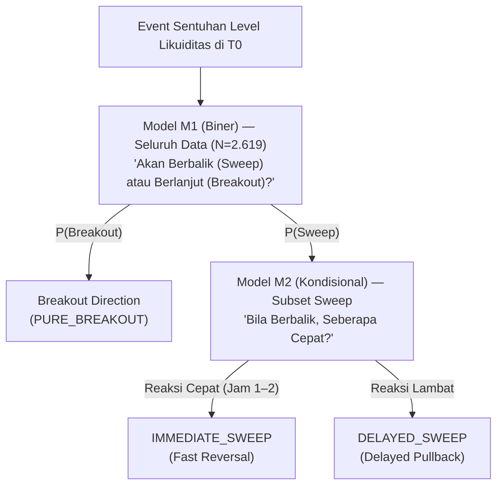
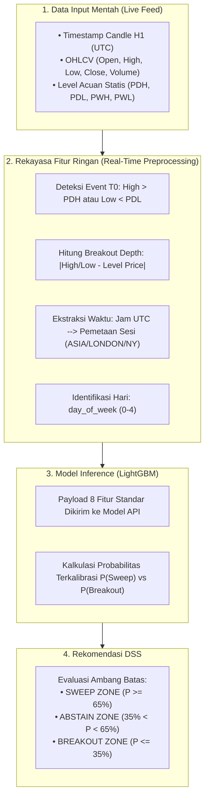

# 06. Fase 3: Pemodelan Prediktif & Sistem Pendukung Keputusan (DSS)

Dokumen ini memaparkan spesifikasi teknis Tahap 3 (Prediktif) yang menjawab **Rumusan Masalah 3 (RM3)**: *"Sejauh mana model machine learning mampu mengestimasi probabilitas sweep vs breakout secara terkalibrasi, dan apakah kemampuannya mengungguli garis dasar (base rate dan tebakan naif)?"*.

---

## 1. Matriks Objektif Fase 3 (P1 – P9)

```text
Fase 1: "Seberapa sering?"          --> Base Rate 51,58%
Fase 2: "Dalam kondisi apa?"        --> Fitur Kontekstual (5 Famili) & IV
Fase 3: "Berapa probabilitasnya?"   --> Probabilitas Terkalibrasi + Abstain Zone
```

| Kode | Objektif Prediktif | Output Konkret & Definisi Operasional |
| :---: | :--- | :--- |
| **P1** | **Formalisasi Task ML** | Penetapan unit observasi ($T_0$), horizon ($N=6$), dan struktur model hierarkis (M1/M2). |
| **P2** | **Garis Dasar Berjenjang (*Tiered Baselines*)** | Tiga baseline wajib (**B0, B1, B2**) yang harus dikalahkan oleh model utama. |
| **P3** | **Protokol Validasi Anti-Kebocoran** | *Purged Expanding Walk-Forward CV* (6 fold: 2019 $\rightarrow$ 2024) + *Embargo* 6 candle. |
| **P4** | **Pemilihan & Penyetelan Model** | *LightGBM* dan *Logistic Regression* dengan optimasi Bayesian / Grid Search (Supervised Learning). |
| **P5** | **Metrik Evaluasi & Kalibrasi** | **PR-AUC, Brier Score, ECE, MCC, Kurva Reliabilitas**, dan *Platt Scaling* / *Isotonic Regression*. |
| **P6** | **Kebijakan Keputusan DSS** | Ambang batas keputusan probabilistik + **Zona Abstain (*Abstain Zone*)**. |
| **P7** | **Pernyataan Batasan Statistik** | Penegasan evaluasi kualitas probabilistik non-finansial (tanpa simulasi profit). |
| **P8** | **Interpretabilitas & Explainability** | SHAP (*SHapley Additive exPlanations*) global & visualisasi waterfall per-event. |
| **P9** | **Validasi Out-of-Sample Final** | Pengujian OOS terkunci (2025–Juli 2026, 387 event) — **dijalankan tepat 1 kali**. |

---

## 2. P1 — Formalisasi Task & Rekomendasi Model Hierarkis

### 2.1 Spesifikasi Task
- **Unit Observasi:** Satu baris event = sentuhan pertama harga pada level likuiditas di waktu $T_0$.
- **Keluaran Model:** Vektor probabilitas yang terkalibrasi $\hat{P} \in [0, 1]$, **bukan label biner hitam-putih**.
- **Waktu Keputusan:** Dilakukan tepat saat penutupan candle crossover $T_0$ menggunakan fitur yang tersedia secara *point-in-time*.

### 2.2 Arsitektur Model Hierarkis Dua Tingkat (M1 & M2)
Memecah problem multiclass menjadi dua model yang lebih stabil:



1. **Model M1 (Struktural - Biner):** Membedakan *Sweep* vs *Breakout* ($P(Y=1 \mid X)$) menggunakan seluruh 2.619 event harian.
2. **Model M2 (Kecepatan Pembalikan - Kondisional):** Membedakan `IMMEDIATE_SWEEP` vs `DELAYED_SWEEP` pada subset event *sweep*.
3. **Keuntungan:** Menjaga kestabilan estimasi kelas dominan saat kelas minoritas mengalami volatilitas.

---

## 3. P2 — Sistem Garis Dasar Berjenjang (*Tiered Baselines*)

Sebuah model Machine Learning hanya dapat diklaim memberikan nilai tambah jika terbukti secara statistik mengungguli garis dasar berikut:

| Tingkat Baseline | Definisi & Formula | Sumber Metodologis | Makna Ilmiah Bila Model Gagal Mengalahkan |
| :--- | :--- | :---: | :--- |
| **B0 (Garis Dasar Nol)** | Tebak selalu kelas mayoritas (*Base Rate* harian: 51,58%). | [[04_fase_1_deskriptif\|D3 (Fase 1)]] | Model sama sekali tidak mempelajari pola pasar. |
| **B1 (Garis Dasar Aturan Tunggal)** | Aturan heuristik terbaik (misal: `IF adr_used_pct > 80% THEN Sweep`). | [[05_fase_2_diagnostik\|G3 / G5 (Fase 2)]] | Machine Learning kompleks tidak memberikan nilai tambah di atas aturan sederhana. |
| **B2 (Garis Dasar Linier)** | Regresi Logistik teratur (L2) menggunakan 5 fitur teratas berdasarkan Information Value (IV). | [[05_fase_2_diagnostik\|G2 (Fase 2)]] | Kompleksitas model non-linier (*tree-based*) tidak sepadan dengan hilangnya interpretabilitas. |

> **Prinsip Parsimoni:** Jika model *Gradient Boosting* hanya unggul tipis ($< 1,5\%$) di atas Regresi Logistik, **pilih Regresi Logistik** karena dalam DSS medis/finansial, kesederhanaan dan transparansi bobot koefisien jauh lebih berharga.

---

## 4. P3 — Protokol Validasi Anti-Kebocoran (*Purged Walk-Forward CV*)

### 4.1 Mengapa Validasi Acak (Random K-Fold) Dilarang?
Dalam pasar keuangan, data bersifat kronologis dan saling terkait dari waktu ke waktu. Lebih krusial lagi, label pada riset ini dihitung dari **kejadian 6 jam ke depan ($N=6$)**.
Jika data diacak secara sembarangan (*Random Cross-Validation*), AI akan "mengintip masa depan" untuk menebak masa lalu (*Data Leakage* / kebocoran data). Hal ini membuat model terlihat seolah-olah sangat pintar di komputer, namun langsung gagal saat diaplikasikan di pasar nyata.

### 4.2 Skema Expanding Walk-Forward dengan Purging & Embargo

```text
Fold 1: [=== Train 2016-2018 ===] --(Purge & Embargo 6H)--> [Val 2019]
Fold 2: [===== Train 2016-2019 =====] --(Purge & Embargo)--> [Val 2020]
Fold 3: [======= Train 2016-2020 =======] --(Purge & Embargo)--> [Val 2021]
Fold 4: [========= Train 2016-2021 =========] --(Purge & Embargo)--> [Val 2022]
Fold 5: [=========== Train 2016-2022 ===========] --(Purge & Embargo)--> [Val 2023]
Fold 6: [============= Train 2016-2023 =============] --(Purge & Embargo)--> [Val 2024]
========================================================================================
OOS TEST (KUNCI): 2025 - Juli 2026 (Dievaluasi Tepat 1 Kali Saja di Akhir)
```

Tiga pilar mekanisme pertahanan protokol P3:
1. **Expanding Walk-Forward:** Model dilatih secara kronologis bertahap layaknya trader manusia yang menambah pengalaman dari tahun ke tahun (data latih selalu berada di masa lalu dari data validasi).
2. **Purging (Pembersihan Tumpang Tindih):** Menghapus data latihan di akhir periode yang jendela evaluasi 6-jamnya menembus masuk ke awal periode validasi agar tidak ada informasi masa depan yang bocor.
3. **Embargo (Karantina Waktu):** Memberi jeda pengaman minimal $\ge 6$ jam/candle setelah data latih selesai sebelum data validasi dimulai untuk mengeliminasi sisa efek autokorelasi serial dan lonjakan volatilitas.
4. **Out-of-Sample (OOS) Test Terkunci:** Data **2025 – Juli 2026 (387 event)** disimpan di "brankas" dan tidak pernah dilihat model selama iterasi riset. Data ini hanya diuji **tepat 1 kali** sebagai ujian kelulusan akhir model.

---

## 5. P4 — Penanganan Ketidakseimbangan Kelas (*Imbalance Handling*)

1. **Penyesuaian Bobot (*Class Weighting*):** Menerapkan `class_weight='balanced'` atau `scale_pos_weight` pada loss function agar model memberi perhatian ekstra pada kelas minoritas (*Pure Breakout*).
2. **Larangan SMOTE pada Data Deret Waktu:**
   > [!WARNING]
   > **SMOTE (*Synthetic Minority Over-sampling Technique*) dilarang keras.** SMOTE membuat sampel sintetis dengan melakukan interpolasi k-NN acak antar-event dari berbagai periode waktu, yang secara permanen merusak struktur temporal dan autokorelasi serial pasar finansial.

---

## 6. P5 — Kalibrasi Probabilitas & Metrik Evaluasi

### 6.1 Mengapa Kalibrasi Probabilitas Mutlak Diperlukan?
Model berbasis pohon (*Tree-based* seperti *LightGBM* dan *Random Forest*) sering kali **terlalu percaya diri (*overconfident*)**—misalnya memprediksi keyakinan 90%, padahal kenyataannya hanya 60% yang benar.

Dalam Sistem Pendukung Keputusan (DSS), nilai probabilitas harus **jujur dan terkalibrasi secara empiris**:
> Jika DSS menyatakan suatu kondisi memiliki $P(\text{Sweep}) = 80\%$, maka dari 100 kali kondisi serupa terjadi di pasar, **tepat 80 kejadian harus benar-benar berakhir sebagai Sweep**.

- **Metode Kalibrasi:** 
  - **Platt Scaling (Sigmoid Logistik):** Melunakkan kurva probabilitas menggunakan fungsi logistik halus.
  - **Isotonic Regression:** Menata ulang probabilitas secara bertingkat (fungsi monoton naik) agar sesuai dengan proporsi riil.
- **Metrik Evaluasi Kalibrasi (Mengukur Kejujuran Model):** 
  - **Expected Calibration Error (ECE):** Mengukur selisih rata-rata antara tingkat keyakinan AI dengan akurasi aktualnya di pasar. Semakin kecil nilainya (mendekati 0), AI semakin jujur dan tidak sesumbar.
  - **Brier Score:** Mengukur selisih kuadrat antara probabilitas prediksi dengan hasil aktual ($\text{Brier} = \frac{1}{N} \sum_{i=1}^N (f_i - o_i)^2$). Nilai mendekati 0 mengindikasikan kalibrasi yang semakin sempurna.

### 6.2 Metrik Evaluasi Data Imbalance (Anti-Tertipu Akurasi Semu)
Karena kejadian *Pure Breakout* relatif lebih jarang dibandingkan *Sweep*, metrik persentase akurasi biasa sangat menyesatkan (AI pemalas yang selalu menebak *Sweep* bisa tampak memiliki akurasi tinggi padahal tidak berguna). Oleh karena itu, digunakan metrik khusus:

- **PR-AUC (*Area Under Precision-Recall Curve*):** 
  Fokus mengevaluasi: *"Saat AI membunyikan alarm peluang Breakout langka, seberapa tepat tebakannya (Precision) dan seberapa banyak peluang langka yang berhasil ditangkap (Recall)?"*. Metrik ini jauh lebih informatif daripada ROC-AUC pada data yang tidak seimbang.
- **MCC (*Matthews Correlation Coefficient*):** 
  Metrik evaluasi seimbang berskala **-1 hingga +1** yang memperhitungkan seluruh kuadran confusion matrix (True Positive, False Positive, True Negative, False Negative):
  $$\text{MCC} = \frac{TP \times TN - FP \times FN}{\sqrt{(TP+FP)(TP+FN)(TN+FP)(TN+FN)}}$$
  - **+1:** Prediksi sempurna (selalu benar menebak *Sweep* maupun *Breakout*).
  - **0:** Setara tebakan acak / lempar koin (tidak belajar apa pun).
  - **-1:** Prediksi terbalik total dari kenyataan.

> [!NOTE]
> **Catatan Konseptual:** 
> - **MCC** adalah **metrik evaluasi performa** pada *Supervised Learning*, **bukan** simulasi *Monte Carlo* (uji skenario acak risiko modal) dan **bukan** algoritma *Reinforcement Learning* (pembelajaran berbasis agen/hadiah-hukuman).
> - Riset ini berfokus pada **Supervised Learning** (pembelajaran pola terarah dari data berlabel historis) untuk menghasilkan rekomendasi pendukung keputusan bagi trader manusia.

---

## 7. P6 — Kebijakan Keputusan DSS & Zona Abstain (*Abstain Zone*)

Sistem Pendukung Keputusan tidak boleh memaksakan prediksi ketika model berada dalam kondisi ragu-ragu:

```text
Probabilitas Sweep P(Sweep | X)
0.0%                    35.0%                     65.0%                   100.0%
 [----- BREAKOUT ZONE -----] [--- ABSTAIN ZONE ---] [------ SWEEP ZONE ------]
         (High Conf)             (NO TRADE / AMBIGUOUS)        (High Conf)
```

| Rentang Probabilitas $P(\text{Sweep})$ | Klasifikasi Rekomendasi DSS | Tindakan Pelaku Pasar |
| :---: | :---: | :--- |
| **$P \ge 65,0\%$** | **Konfirmasi Kuat: *Liquidity Sweep*** | Mempertimbangkan posisi pembalikan arah (*fade/reversal*). |
| **$35,0\% < P < 65,0\%$** | **`ZONA ABSTAIN (NO DECISION)`** | **Tidak Mengambil Posisi.** Menunggu konfirmasi aksi harga lanjutan. |
| **$P \le 35,0\%$** | **Konfirmasi Kuat: *Breakout Continuation*** | Mempertimbangkan posisi kelanjutan tren (*follow/breakout*). |

---

## 8. P8 — Interpretabilitas Model via SHAP

Untuk memastikan model bukan merupakan *black box*:
1. **Global Feature Importance:** Menilai fitur yang paling konsisten memandu keputusan model (misal: `adr_used_pct`, `session`, `htf_trend_direction`, `level_confluence_flag`).
2. **Local Explanation (Waterfall Plot per Event):** Menjelaskan kepada pengguna faktor apa yang mendorong probabilitas *sweep* naik atau turun pada event spesifik saat ini.

---

## 9. Alur Inferensi Real-Time & Rekayasa Fitur Lapangan (Serving Pipeline)

Saat sistem dioperasikan secara *live* untuk memberikan rekomendasi kepada *trader*, model AI tidak dapat menerima data harga mentah ($Open, High, Low, Close$) secara langsung karena nilai nominal harga emas selalu berubah dari tahun ke tahun. Oleh karena itu, data mentah harus melalui proses **Rekayasa Fitur Real-Time (*Real-Time Feature Engineering*)** yang sangat cepat (hitungan milidetik).

### 9.1 Diagram Alur Ekstraksi Fitur Real-Time



### 9.2 Matriks 8 Fitur Input Wajib untuk Inferensi Real-Time

| Kategori Fitur | Nama Kolom / Fitur | Tipe Data | Contoh Nilai | Penjelasan Sederhana |
| :--- | :--- | :---: | :---: | :--- |
| **Identitas Level** | `level_type` | Kategorikal | `PDH`, `PDL`, `PWH`, `PWL` | Menandakan batas harga mana yang sedang disentuh (Harian atau Mingguan). |
| **Konteks Waktu** | `session` | Kategorikal | `ASIA`, `LONDON`, `NY` | Sesi pasar saat sentuhan terjadi (London/NY lebih volatil dibanding Asia). |
| | `day_of_week` | Integer | `0` (Senin) s/d `4` (Jumat) | Hari terjadinya sentuhan harga. |
| | `hour_of_day` | Integer | `0` s/d `23` (UTC) | Jam candle saat sentuhan terjadi. |
| | `is_weekend_cross` | Biner (0/1) | `0` (Tidak), `1` (Ya) | Apakah sentuhan terjadi saat pembukaan pasar setelah libur akhir pekan. |
| **Aksi Harga & Volume** | `breakout_depth` | Numerik (Float) | `$2.50` (USD) | Kedalaman penembusan level ($\text{High} - \text{Level}$ atau $\text{Level} - \text{Low}$). |
| | `crossover_volume`| Numerik (Float) | `14.500` (Tick Volume) | Volume transaksi pada candle 1 jam saat penembusan terjadi. |
| **Parameter Jendela** | `window_hours` | Numerik | `6.0` (Jam) | Jendela horizon observasi (standar 1 sesi = 6 jam). |

### 9.3 Contoh Payload API & Rekomendasi Output DSS

**Format Request (JSON Input dari Live Feed):**
```json
{
  "session": "LONDON",
  "day_of_week": 2,
  "level_type": "PDH",
  "is_weekend_cross": 0,
  "hour_of_day": 8,
  "crossover_volume": 12450.0,
  "breakout_depth": 3.20,
  "window_hours": 6.0
}
```

**Format Response (JSON Output Rekomendasi DSS):**
```json
{
  "probability_sweep": 0.784,
  "probability_breakout": 0.216,
  "dss_recommendation": "SWEEP ZONE (HIGH CONFIDENCE)",
  "action_guidance": "Pertimbangkan opsi pembalikan arah (reversal/fade). Hindari entry buy breakout."
}
```
