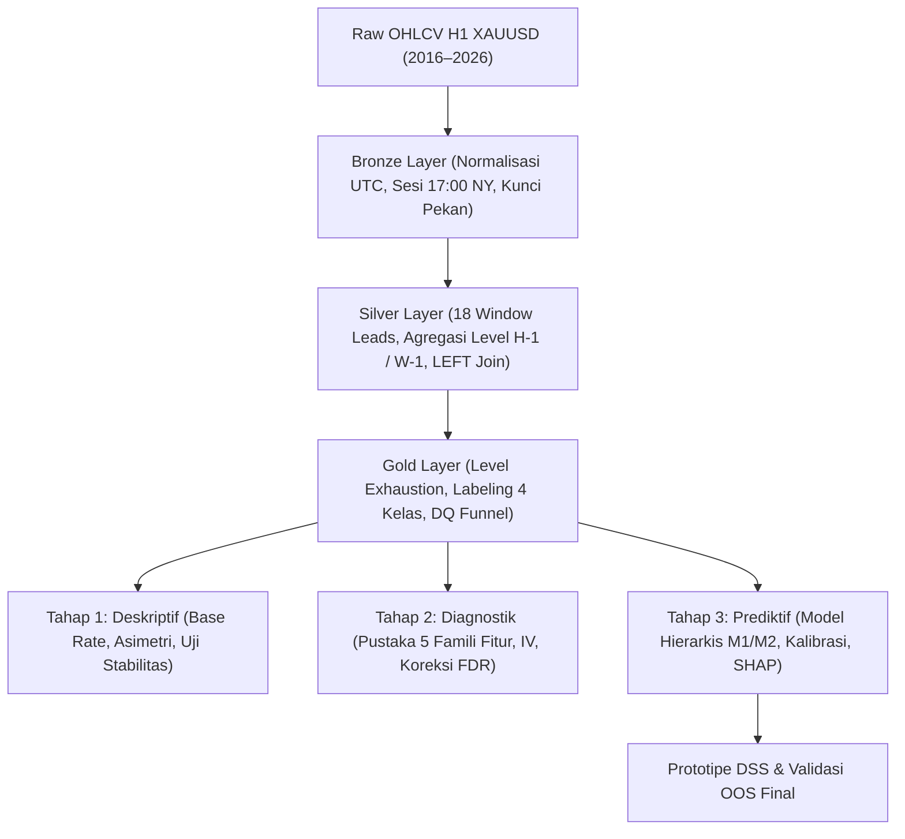

# 08. Naskah Lengkap Draft Proposal Skripsi

> **Dokumen Akademik:** Proposal Penelitian — Skripsi Program Studi Informatika / Ilmu Komputer (Semester 7)  
> **Status:** Draft Pengajuan LMS (Angka Final Tervalidasi Databricks per 16 Agustus 2026)

---

# SISTEM PENDUKUNG KEPUTUSAN KLASIFIKASI *LIQUIDITY SWEEP* DAN *BREAKOUT* PADA LEVEL LIKUIDITAS PDH/PDL INSTRUMEN XAUUSD MENGGUNAKAN *MACHINE LEARNING*

---

## Abstrak

Pada perdagangan instrumen emas (*XAUUSD*), pergerakan harga kerap bereaksi tajam ketika menyentuh level harga tertinggi dan terendah hari sebelumnya (*Previous Day High/Low* - PDH/PDL) yang merupakan titik konsentrasi penumpukan pesanan likuiditas (*pending orders* dan *stop-loss*). Seorang pelaku pasar dihadapkan pada satu pertanyaan keputusan biner yang berulang: ketika harga menembus level tersebut, apakah peristiwa itu merupakan *liquidity sweep* (penembusan semu yang segera ditarik kembali ke dalam rentang harga) atau *breakout* sejati (penembusan struktural yang berlanjut)? Selama ini, keputusan tersebut diambil secara intuitif, subjektif, dan tidak dapat direproduksi secara ilmiah.

Penelitian ini membangun sebuah **Sistem Pendukung Keputusan (*Decision Support System*, DSS)** yang mengklasifikasikan kejadian di level likuiditas secara kuantitatif, terukur, dan probabilistik. Pendekatan penelitian disusun secara berjenjang dalam tiga tahap analitik: **(1) Tahap Deskriptif** — mengukur proporsi dasar (*base rate*) pasti kejadian *sweep* dibandingkan *breakout* beserta selang kepercayaannya; **(2) Tahap Diagnostik** — mengidentifikasi faktor kontekstual (sesi pasar, rezim volatilitas, arah tren, geometri level, dan dinamika pendekatan) yang membedakan kedua fenomena secara statistik; dan **(3) Tahap Prediktif** — melatih model klasifikasi yang menghasilkan estimasi probabilitas yang terkalibrasi (*calibrated probability*) dan membuktikan apakah model mampu mengungguli garis dasar (*baseline*).

Data yang digunakan mencakup OHLCV XAUUSD periode **1 Januari 2016 – 31 Juli 2026**, diolah menggunakan arsitektur *Medallion* (*Bronze $\rightarrow$ Silver $\rightarrow$ Gold*) di atas Databricks/PySpark dan Delta Lake, menghasilkan **3.148 event terstruktur** (2.619 event harian; 529 event mingguan) dengan batas hari perdagangan berbasis sesi (17:00 waktu New York). Variabel target klasifikasi dimodelkan dalam satu variabel `outcome` empat kelas yang saling lepas (*IMMEDIATE_SWEEP*, *DELAYED_SWEEP*, *FAILED_SWEEP*, *PURE_BREAKOUT*). Evaluasi menekankan **kalibrasi probabilitas** (*Brier Score*, *Expected Calibration Error*), kurva *Precision-Recall* (PR-AUC), dan *Matthews Correlation Coefficient* (MCC), yang divalidasi menggunakan protokol *Purged Expanding Walk-Forward Cross-Validation* dengan *Embargo* 6 candle. Luaran akhir penelitian adalah prototipe DSS yang menyertakan kebijakan zona abstain (*abstain zone*) beserta interpretabilitas berbasis SHAP. Penelitian ini secara tegas bersifat analitik statistik pendukung keputusan, **bukan** sistem otomasi perdagangan dan **bukan** nasihat finansial.

**Kata Kunci:** *liquidity sweep*, *breakout*, XAUUSD, sistem pendukung keputusan, klasifikasi probabilistik, kalibrasi, *machine learning*, mikrostruktur pasar.

---

# BAB I — PENDAHULUAN

## 1.1 Latar Belakang Masalah
Emas (*XAUUSD*) merupakan salah satu instrumen keuangan paling likuid dan paling aktif diperdagangkan di pasar komoditas global. Dalam praktik analisis teknikal modern, level harga tertinggi dan terendah dari periode sebelumnya — khususnya *Previous Day High/Low* (PDH/PDL) dan *Previous Week High/Low* (PWH/PWL) — dipandang sebagai **level likuiditas kunci**: area harga tempat terkonsentrasinya pesanan pasar, terutama order *stop-loss* dan *take-profit*. Literatur mikrostruktur pasar memberikan landasan teoretis yang kuat untuk fenomena ini. Kavajecz dan Odders-White (2004) membuktikan secara empiris bahwa level *support* dan *resistance* teknikal berhimpit secara signifikan dengan puncak kedalaman antrean (*depth peak*) pada *limit order book*. Sementara itu, Osler (2003, 2005) menemukan bahwa penumpukan pesanan *stop-loss* di sekitar level teknikal memicu pergerakan harga yang tajam dan berkaskade (*stop-loss cascade*) — mekanisme mikrostruktur yang menjelaskan fenomena *liquidity sweep*.

Ketika harga menyentuh dan menembus level likuiditas, dua fenomena struktural dapat terjadi:
1. Pada **liquidity sweep**, penembusan harga bersifat sementara; likuiditas di luar level diserap oleh pelaku pasar institusional, lalu harga segera ditolak dan berbalik kembali ke dalam rentang sebelumnya (*reversal*).
2. Pada **breakout**, penembusan harga berlanjut secara agresif dan harga menetap di luar rentang (*trend continuation*).

Kedua fenomena ini tampak identik pada detik-detik awal terjadinya penembusan, namun berimplikasi saling bertolak belakang bagi keputusan posisi trader. Kekeliruan dalam membedakan keduanya merupakan salah satu sumber kerugian terbesar: seorang pelaku pasar membuka posisi searah penembusan karena menyangka terjadi *breakout*, padahal pasar sedang mengalami *sweep*, sehingga posisi langsung terlikuidasi.

Masalah mendasar yang dihadapi adalah **proses pengambilan keputusan yang selama ini sangat subjektif, berbasis intuisi semata, dan tidak dapat direproduksi (*unreproducible*)**. Belum ada ukuran baku mengenai seberapa sering *sweep* sebenarnya terjadi, variabel apa yang membedakannya dari *breakout*, maupun seberapa besar tingkat keyakinan yang pantas diberikan pada suatu keputusan. Penelitian ini menutup celah tersebut dengan mentransformasikan persoalan intuitif menjadi masalah **klasifikasi probabilistik yang terukur**: memformalkan definisi kejadian secara algoritmik, mengukur proporsi empirisnya secara statistik, dan mengestimasi probabilitas kejadian menggunakan model *Machine Learning* yang terkalibrasi. Pendekatan memformalkan pola teknikal menjadi definisi kuantitatif yang dapat diuji secara statistik memiliki preseden akademik pada Lo, Mamaysky, dan Wang (2000).

Periode data penelitian ditetapkan dimulai pada **Januari 2016**. Pemilihan ini didasarkan pada pertimbangan metodologis yang teruji: menjaga homogenitas rezim mikrostruktur pasca-2015 sekaligus mempertahankan ukuran sampel data yang cukup besar (2.560 event Daily). Studi pendahuluan membuktikan stabilitas distribusi fitur berbasis ATR (melalui uji *Population Stability Index* / PSI) melintasi era 2016–2026 tanpa terdistorsi oleh kenaikan harga emas nominal.

---

## 1.2 Rumusan Masalah
Penelitian ini dirumuskan dalam tiga pertanyaan ilmiah yang berjenjang:

1. **RM1 (Deskriptif):** Berapa proporsi pasti kejadian *liquidity sweep* dibandingkan *breakout* pada level likuiditas XAUUSD, dan apakah terdapat asimetri proporsi antara level atas (PDH) dan level bawah (PDL)?
2. **RM2 (Diagnostik):** Faktor kontekstual apa (sesi perdagangan, rezim volatilitas, arah tren, geometri level, dan dinamika pendekatan harga) yang secara statistik membedakan *sweep* dari *breakout*, dan seberapa besar ukuran pengaruhnya (*effect size*)?
3. **RM3 (Prediktif):** Sejauh mana model *Machine Learning* mampu mengestimasi probabilitas *sweep* vs *breakout* secara **terkalibrasi**, dan apakah model mampu mengungguli garis dasar (*tiered baselines*)?

---

## 1.3 Tujuan Penelitian

### 1.3.1 Tujuan Umum
Membangun sebuah Sistem Pendukung Keputusan (*Decision Support System*, DSS) yang mengklasifikasikan kejadian di level likuiditas XAUUSD secara kuantitatif, dapat direproduksi, dan menyertakan tingkat keyakinan probabilistik yang terkalibrasi.

### 1.3.2 Tujuan Khusus
1. Menghasilkan dataset event terstruktur yang bebas kebocoran (*data leakage*) dari data mentah OHLCV, beserta pengukuran *base rate* dan selang kepercayaannya (menjawab RM1).
2. Mengidentifikasi dan menguji signifikansi fitur kontekstual pembeda *sweep* dan *breakout* menggunakan koreksi pengujian jamak *Benjamini-Hochberg FDR* dan pelaporan *effect size* (menjawab RM2).
3. Melatih, mengkalibrasi, dan mengevaluasi model klasifikasi probabilistik terhadap garis dasar berjenjang menggunakan metrik yang tahan ketidakseimbangan kelas (menjawab RM3).

---

## 1.4 Manfaat Penelitian
- **Manfaat Teoretis:** Menyediakan bukti empiris yang dapat direproduksi atas fenomena yang selama ini hanya dibahas secara naratif dalam komunitas trading; menjembatani konsep praktis *liquidity sweep* dengan literatur mikrostruktur pasar (*order clustering* dan *stop-loss cascades*).
- **Manfaat Praktis:** Menghasilkan prototipe DSS yang membantu pelaku pasar mengevaluasi kondisi penembusan level likuiditas secara objektif berdasarkan probabilitas terukur dan menyajikan rekomendasi zona abstain saat kondisi pasar ambigu.

---

## 1.5 Batasan Masalah & Pernyataan Etis

### 1.5.1 Batasan Masalah
1. **Instrumen Tunggal:** Penelitian dibatasi pada instrumen **XAUUSD** pada periode **2016-01-01 s/d 2026-07-31**.
2. **Cakupan Level:** Level likuiditas dibatasi pada PDH/PDL (utama untuk pemodelan ML) dan PWH/PWL (sekunder untuk analisis deskriptif dan injeksi fitur konfluensi).
3. **Sifat Volume:** Data volume yang tersedia adalah *tick volume*, bukan volume transaksi riil terpusat.
4. **Batas Ruang Lingkup Evaluasi:** Evaluasi dibatasi pada performa **klasifikasi statistik dan kalibrasi probabilitas**, bukan simulasi profitabilitas ekonomi (faktor *spread*, komisi broker, dan *slippage* berada di luar cakupan).

### 1.5.2 Pernyataan Etis
Penelitian ini merupakan studi struktural pasar untuk tujuan akademik murni. Sistem yang dibangun adalah sistem **pendukung keputusan (*Decision Support System*)**, **bukan** robot perdagangan otomatis (*Expert Advisor* / EA) dan **bukan** nasihat finansial. Segala risiko atas keputusan finansial di pasar riil sepenuhnya berada pada pengguna.

---

## 1.6 Hasil Studi Pendahuluan (Kelayakan Riset)
Tahap deskriptif telah dieksekusi penuh di Databricks sebagai studi kelayakan empiris dengan temuan awal sebagai berikut:
- **Ukuran Sampel Memadai:** Terbentuk **3.148 event terstruktur** (2.619 event harian; 529 event mingguan) selama 2016–Juli 2026.
- **Base Rate Seimbang:** Proporsi *sweep* harian agregat adalah **51,58%** (SK 95% Wilson: [49,67% – 53,49%]).
- **Asimetri Nyata PDH vs PDL:** Level PDL memiliki *sweep rate* sebesar **55,41%** [52,61% – 58,18%], sedangkan level PDH hanya sebesar **48,25%** [45,64% – 50,87%]. Kedua selang kepercayaan **terpisah bersih tanpa irisan**.
- **Frekuensi Kelas Jebakan (*Failed Sweep*):** Kondisi *Failed Sweep* mencakup **17,49% event**, membuktikan bahwa kelas minoritas ini cukup signifikan untuk dimodelkan.
- **Stabilitas Lintas Periode:** Proporsi *sweep* pada *Train* (51,86%), *Validation* (52,44%), dan *OOS* (50,13%) saling beririsan konsisten, membuktikan ketiadaan *regime shift*.

---

# BAB II — TINJAUAN PUSTAKA

## 2.1 Mikrostruktur Pasar & Pembingkaian Netral Konsep Likuiditas
Gagasan mengenai level likuiditas berakar pada teori mikrostruktur pasar bahwa pesanan tidak tersebar merata, melainkan menggerombol di level-level psikologis dan teknikal masa lalu (Kavajecz & Odders-White, 2004; Osler, 2003, 2005). Ketika pesanan *stop-loss* yang menumpuk di luar level tersentuh, terjadi percepatan pergerakan harga sementara. Bila tidak ada pesanan beli/jual lanjutan yang menopang, harga akan segera terserap kembali ke dalam rentang.

> **Pembingkaian Netral atas Istilah Ritel (ICT):**
> Istilah "*liquidity sweep*" dipopulerkan oleh komunitas trading ritel (*Inner Circle Trader* / ICT) yang tidak memiliki landasan *peer-reviewed*. Penelitian ini secara sadar tidak mengadopsi narasi dogmatis tersebut, melainkan menguji pertanyaan empiris yang netral dan dapat difalsifikasi: *"Ketika harga menembus level tertinggi/terendah kemarin, seberapa sering harga ditutup kembali di dalam rentang dalam 6 jam ke depan, dan faktor apa yang memengaruhinya?"*.

---

## 2.2 Klasifikasi Probabilistik pada Data Deret Waktu Keuangan

### 2.2.1 Pilihan Algoritma Pemodelan
Untuk data tabular berukuran ribuan sampel dengan fitur non-linier heterogen, algoritma pohon teratur (*Gradient Boosted Decision Trees*) seperti **LightGBM** (Ke et al., 2017) dan **Random Forest** secara konsisten menjadi baku industri. Penelitian ini menempuh urutan pemodelan parsimonis:
1. **Regresi Logistik Teratur (L2):** Sebagai *baseline* linier transparan.
2. **LightGBM / Gradient Boosting:** Sebagai model non-linier utama.
3. *Deep Learning* sengaja dihindari karena ukuran sampel ($N = 2.619$) tidak memenuhi kebutuhan representasi jaringan dalam dan interpretabilitas merupakan prioritas utama DSS.

### 2.2.2 Kalibrasi Probabilitas & Metrik Evaluasi Data Timpang
Dalam data pasar yang tidak seimbang, akurasi mentah menyesatkan (López de Prado, 2018). Evaluasi dipusatkan pada **Area Under Precision-Recall Curve (PR-AUC)** (Saito & Rehmsmeier, 2015), **Brier Score** (Brier, 1950), dan **Matthews Correlation Coefficient (MCC)**. Kalibrasi probabilitas diperbaiki menggunakan *Platt Scaling* (Platt, 1999) atau *Isotonic Regression* (Zadrozny & Elkan, 2002).

### 2.2.3 Interpretabilitas dengan SHAP
Untuk menjamin transparansi keputusan, atribusi kontribusi setiap fitur kontekstual dihitung menggunakan **SHAP (*SHapley Additive exPlanations*)** (Lundberg & Lee, 2017).

### 2.2.4 Formalisasi Zona Abstain Berbasis Conformal Prediction
Dalam sistem pendukung keputusan (DSS), memaksakan keputusan deterministik pada probabilitas yang ambigu merupakan penyebab utama kerugian (*false confidence*). Penelitian ini mengadopsi formalisasi *Classification with Reject Option* (Abstain) berbasis *Conformal Prediction* (Elsevier MLWA, 2025) yang menjamin batas kesalahan teoretis non-parametrik ($1 - \alpha$) pada himpunan prediksi keluaran.

---

## 2.3 Posisi Penelitian Terhadap Literatur Terkait

Tinjauan terhadap penelitian prediksi pergerakan harga emas (*XAUUSD*) dan sistem perdagangan berbasis data menunjukkan spektrum metodologi berikut:

1. **Mikrostruktur & Klasterisasi Stop-Loss:**
   Osler (2005) dan studi SSRN (2011) membuktikan bahwa pesanan *stop-loss* mengelompok di level ekstrim masa lalu (PDH/PDL), memicu *price cascade* kilat yang diserap institusi. Neely & Weller (1996) menegaskan bahwa level teknikal menjadi titik reaksi intervensi volume besar.
2. **Studi Prediksi Arah Lilin (*Candle Direction*) Naif:**
   Novianto dan Wibowo (2023) meneliti klasifikasi tren harga XAUUSD menggunakan *Gaussian Naïve Bayes* pada data 2022 (F1-score 49,99%–55,44%). Hasil ini mengonfirmasi bahwa memprediksi candle kontinu per-satuan waktu tanpa struktur likuiditas terjebak dalam *random walk*.
3. **Studi Breakout & Peramalan Hibrida:**
   Jurnal Indonesia (2024) mendokumentasikan probabilitas breakout S/R pada XAUUSD H1 (~72,73%), sedangkan Masoumian dan Shafaei (2026) merancang sistem trading hibrida XGBoost pada 300.000+ data M5 XAUUSD dengan validasi *purged walk-forward* dan Monte Carlo. SciTePress (2024a, 2024b) serta SSRN (2026a) menegaskan keunggulan ensemble *Gradient Boosting* atas ARIMA/GARCH (Research Square, 2025; SSRN, 2025) untuk data tabular keuangan.
4. **Integritas Metodologi & Pencegahan Overfitting:**
   *International Journal of Forecasting* (2014) mengkritik *data snooping* pada analisis teknikal, menjustifikasi kewajiban koreksi *Benjamini-Hochberg FDR*. SSRN (2026b) memperkenalkan metrik *Walk-Forward Correlation* untuk menguji *structural edge* sejati.

Tabel berikut merangkum pemosisian penelitian ini terhadap literatur:

| Dimensi Komparasi | Studi Konvensional (Novianto 2023) | Sistem Hibrida SOTA (Masoumian 2026) | **Pendekatan Penelitian Ini** |
| :--- | :--- | :--- | :--- |
| **Unit Analisis** | Berbasis Waktu (*time-step* / per candle) | Berbasis Waktu (*rolling M5 window*) | **Berbasis Event (*first-touch event* pada $T_0$)** |
| **Target Prediksi** | Arah Lilin Biner (Naik / Turun) | Peramalan 12-Step OHLC $\rightarrow$ *Deviation Score* | **Struktur Reaksi Likuiditas (4 Kelas Saling Lepas)** |
| **Rekayasa Fitur** | Data Mentah OHLCV (Non-Stasioner) | 28 Fitur Indikator & Rasio Geometri | **~40 Fitur (5 Famili: Sesi, ATR, Tren, Geometri, Dinamika)** |
| **Bentuk Output** | Sinyal Biner Hitam-Putih | Sinyal Eksekusi Otomatis (*Expert Advisor*) | **Probabilitas Terkalibrasi + Zona Abstain (*DSS*)** |
| **Metrik Evaluasi** | Akurasi & F1-Score Sederhana | Metrik Finansial (Sharpe, Profit Factor, DD) | **PR-AUC, Brier Score, ECE, MCC, SHAP Value** |
| **Skema Validasi** | *Random Split* 80:20 | *Purged Walk-Forward* + Monte Carlo 50k | ***Purged Expanding Walk-Forward CV* + Embargo 6-Bar + OOS Terkunci** |

---

# BAB III — METODOLOGI PENELITIAN

## 3.1 Alur Penelitian

---

## 3.2 Data dan Pembagian Dataset
- **Sumber Data:** OHLCV XAUUSD timeframe H1 (2016-01-01 s/d 2026-07-31).
- **Batas Hari Sesi:** Pukul 17:00 waktu New York (sadar DST).
- **Skema Validasi:** *Purged Expanding Walk-Forward Cross-Validation* (6 fold validasi bergerak: 2019 $\rightarrow$ 2024) dengan jeda *Embargo* 6 candle.
- **Out-of-Sample (OOS) Test Set:** Data periode 2025–Juli 2026 (387 event) dikunci dan dievaluasi tepat satu kali di akhir penelitian.
- **Diagnostik Validasi:** Evaluasi konsistensi *Walk-Forward Correlation* (SSRN, 2026b) untuk membuktikan ketiadaan *overfitting*.

---

## 3.3 Rekayasa Label & Skema Gold Dataset
- **Definisi Event:** Sentuhan pertama harga pada level likuiditas (`touch_rank = 1`).
- **Jendela Observasi:** $N = 6$ candle H1 setelah $T_0$.
- **Target `outcome` 4 Kelas:**
  $$\begin{aligned}
  \text{returned\_early} &= (C_{t+1} \le \text{Level}) \lor (C_{t+2} \le \text{Level}) \\
  \text{ended\_inside}   &= (C_{t+6} \le \text{Level})
  \end{aligned}$$
  Menghasilkan: `IMMEDIATE_SWEEP`, `DELAYED_SWEEP`, `FAILED_SWEEP`, dan `PURE_BREAKOUT`.

---

## 3.4 Pustaka Fitur Kontekstual (5 Famili)
1. **Famili A (Temporal & Sesi):** `hour_of_day`, `session`, `day_of_week`, `is_session_open_hour`, `hours_to_weekly_close`.
2. **Famili B (Rezim Volatilitas):** `atr_14`, `atr_ratio_vs_median60`, `adr_used_pct`, `bb_width`.
3. **Famili C (Tren & Struktur):** `htf_trend_direction`, `price_vs_ema_atr`, `adx_14`, `consecutive_d1_direction`.
4. **Famili D (Geometri Level):** `prev_range_width_atr`, `level_confluence_flag`, `distance_to_next_level_atr`, `level_age_hours`.
5. **Famili E (Dinamika Pendekatan):** `travel_from_day_open_atr`, `hours_since_day_open`, `cum_return_3`, `opposite_level_swept_today`.

---

## 3.5 Pemodelan, Kalibrasi, dan Sistem Pendukung Keputusan
- **Model Hierarkis:** Model M1 (Biner: Sweep vs Breakout) dilatih pada seluruh data harian ($N = 2.619$); Model M2 (Kondisional: Immediate vs Delayed) dilatih pada subset *sweep*.
- **Garis Dasar Wajib:** Baseline B0 (*Base Rate*), B1 (*Best Single Rule*), B2 (*Logistic Regression 5 Top Features*).
- **Kebijakan DSS Bergaransi Conformal:**
  - $P(\text{Sweep} \mid X) \ge 65,0\% \implies \text{Rekomendasi Sweep (Reversal)}$
  - $P(\text{Sweep} \mid X) \le 35,0\% \implies \text{Rekomendasi Breakout (Continuation)}$
  - $35,0\% < P(\text{Sweep} \mid X) < 65,0\% \implies \text{Zona Abstain (Reject Option via Conformal Prediction, Error Guarantee } \le 10\%)$

---

# DAFTAR PUSTAKA UTAMA

1. **Brier, G. W. (1950).** Verification of forecasts expressed in terms of probability. *Monthly Weather Review*, 78(1), 1-3.
2. **Elsevier MLWA (2025).** Classification with Reject Option: Distribution-free Error Guarantees via Conformal Prediction. *Machine Learning with Applications*, 100664.
3. **International Journal of Forecasting (2014).** Illusory Profitability of Technical Analysis in Emerging Foreign Exchange Markets. *International Journal of Forecasting*, 30(1), 1-15.
4. **Jurnal Indonesia (2024).** Uji Efektivitas Metode Breakout Support Resistance untuk Probabilitas pada Forex. *Jurnal Ilmiah*, DOI: 10.36985/saj8g536.
5. **Kavajecz, K. A., & Odders-White, E. R. (2004).** Technical analysis and liquidity in the NYSE. *The Journal of Finance*, 59(3), 1047-1071.
6. **Ke, G., et al. (2017).** LightGBM: A highly efficient gradient boosting decision tree. *Advances in Neural Information Processing Systems*, 30.
7. **Lo, A. W., Mamaysky, H., & Wang, J. (2000).** Foundations of technical analysis: Computational algorithms, statistical inference, and empirical implementation. *The Journal of Finance*, 55(4), 1705-1765.
8. **López de Prado, M. (2018).** *Advances in Financial Machine Learning*. John Wiley & Sons.
9. **Lundberg, S. M., & Lee, S. I. (2017).** A unified approach to interpreting model predictions. *Advances in Neural Information Processing Systems*, 30.
10. **Masoumian, M. M., & Shafaei, R. (2026).** A Hybrid Machine Learning and Rule-Based Decision Support System for Short-Term Trading: A Case Study on XAUUSD. *SSRN Working Paper*, SSRN-id7279718.
11. **Neely, C. J., & Weller, P. A. (1996).** Technical Trading Rule Profitability and Foreign Exchange Intervention. *NBER Working Paper*, No. w5505.
12. **Novianto, S., & Wibowo, H. A. (2023).** The Implementation of Data Mining for Predicting XAU/USD Price Trends in the Forex Market on Meta Trader 5 using Naïve Bayes Method. *INTELMATICS*, 3(2), 85-90.
13. **Osler, C. L. (2003).** Currency orders and exchange rate dynamics: An explanation for technical analysis. *The Journal of Finance*, 58(5), 1791-1819.
14. **Osler, C. L. (2005).** Stop-loss orders and price cascades in currency markets. *Journal of International Money and Finance*, 24(2), 219-241.
15. **SciTePress (2024a).** Gold Price Relative Return Prediction with Machine Learning Models. *Proceedings of SciTePress*, DOI: 10.5220/0013528700004619.
16. **SciTePress (2024b).** Machine Learning Models for Gold Price Prediction: A Comparative Study. *Proceedings of SciTePress*, DOI: 10.5220/0014884800005130.
17. **SSRN (2011).** Luck Favors the Prepared Especially Those Who Placed Stop-Loss Orders. *SSRN Electronic Journal*, SSRN-id1921383.
18. **SSRN (2025).** Volatility Forecasting in Financial Time-Series: GARCH vs XGBoost vs LSTM. *SSRN Electronic Journal*, SSRN-id5595710.
19. **SSRN (2026a).** Comparative Evaluation of Machine Learning Classifiers for Short-Term Gold Price Direction. *SSRN Electronic Journal*, SSRN-id6323238.
20. **SSRN (2026b).** Walk Forward Correlation: A Diagnostic for Over-Fitting and Structural Edge. *SSRN Electronic Journal*, SSRN-id6324079.
