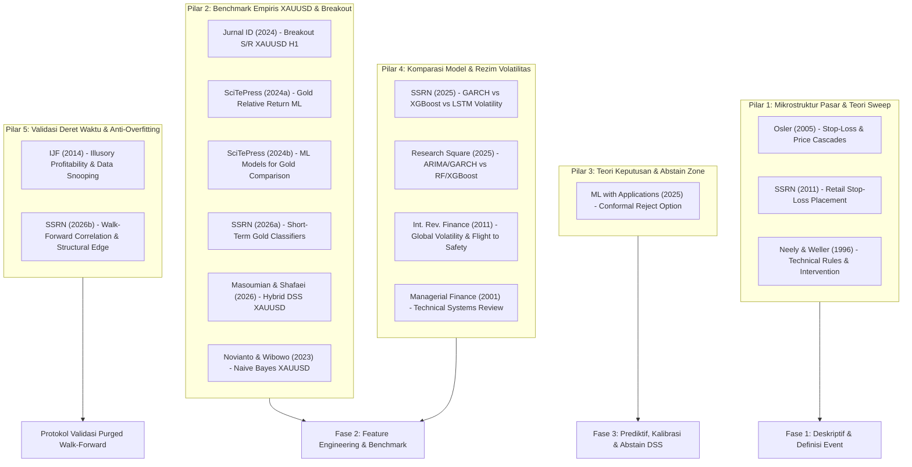
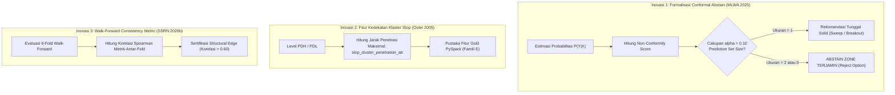

# 16. Kajian Literatur Master: Analisis 14 Artikel Ilmiah & Pemetaan Relevansi Implementasi Riset

Dokumen ini merupakan sintesis komprehensif atas **14 artikel ilmiah rujukan** (beserta 2 artikel repositori `reference/`) yang menjadi landasan teoretis, empiris, metodologis, dan komputasional bagi penelitian:
**"Sistem Pendukung Keputusan Klasifikasi *Liquidity Sweep* dan *Breakout* pada Level Likuiditas PDH/PDL Instrumen XAUUSD Menggunakan *Machine Learning*"**.

---

## 1. Peta Taksonomi Literatur (5 Pilar Ilmiah)

Seluruh 14 artikel terdistribusi ke dalam **5 Pilar Utama** yang menopang arsitektur riset 3-fase:



---

## 2. Tabel Master Analisis 14 Artikel Ilmiah

|   No   | Judul Artikel                                                                                     | Penulis & Tahun               | Sumber / DOI                                                                                                    |           Kategori Pilar            |     Relevansi     | Pemetaan Konkret ke Bab & Modul Riset                                                                                                                                                                                      |
| :----: | :------------------------------------------------------------------------------------------------ | :---------------------------- | :-------------------------------------------------------------------------------------------------------------- | :---------------------------------: | :---------------: | :------------------------------------------------------------------------------------------------------------------------------------------------------------------------------------------------------------------------- |
| **1**  | *Stop-Loss Orders and Price Cascades in Currency Markets*                                         | Osler (2005)                  | *J. Int. Money & Finance*<br>[`10.1016/j.jimonfin.2004.12.002`](https://doi.org/10.1016/j.jimonfin.2004.12.002) |     **Pilar 1** (Mikrostruktur)     | **SANGAT TINGGI** | **BAB I & BAB II:** Landasan teoretis bahwa *liquidity sweep* dipicu oleh klasterisasi *stop-loss orders* di luar PDH/PDL yang memicu kaskade harga kilat sebelum diserap institusi.                                       |
| **2**  | *Uji Efektivitas Metode Breakout Support Resistance untuk Probabilitas pada Forex*                | Jurnal Indonesia (2024)       | Jurnal Nasional<br>[`10.36985/saj8g536`](https://doi.org/10.36985/saj8g536)                                     |   **Pilar 2** (Benchmark XAUUSD)    | **SANGAT TINGGI** | **BAB II & BAB III:** Benchmark langsung pada instrumen & timeframe identik (**XAUUSD H1**). Memberikan komparasi empiris untuk kelas `PURE_BREAKOUT` (probabilitas baseline ~72,73% pada kondisi breakout terkonfirmasi). |
| **3**  | *Classification with Reject Option: Distribution-free Error Guarantees via Conformal Prediction*  | ML with Applications (2025)   | *Elsevier MLWA*<br>[`10.1016/j.mlwa.2025.100664`](https://doi.org/10.1016/j.mlwa.2025.100664)                   |    **Pilar 3** (Abstain Theory)     | **SANGAT TINGGI** | **BAB II, BAB III & Modul DSS (P6):** Mengubah *Abstain Zone* dari threshold heuristik menjadi formalisasi matematis berbasis *Conformal Prediction* dengan jaminan batas error non-parametrik ($1 - \alpha$).             |
| **4**  | *Gold Price Relative Return Prediction with Machine Learning Models*                              | SciTePress (2024a)            | *SciTePress Book / Proc.*<br>[`10.5220/0013528700004619`](https://doi.org/10.5220/0013528700004619)             |     **Pilar 2** (Prediksi Emas)     |    **TINGGI**     | **BAB II & Rekayasa Fitur (Fase 2):** Justifikasi pemodelan return relatif dan normalisasi fitur terhadap harga emas nominal agar model kebal terhadap tren kenaikan harga jangka panjang.                                 |
| **5**  | *Machine Learning Models for Gold Price Prediction: A Comparative Study*                          | SciTePress (2024b)            | *SciTePress Book / Proc.*<br>[`10.5220/0014884800005130`](https://doi.org/10.5220/0014884800005130)             |    **Pilar 2** (Komparasi Model)    |    **TINGGI**     | **BAB II & BAB III (P2/P4):** Memperkuat justifikasi hirarki baseline (B2 Logistic Regression vs LightGBM/XGBoost) khusus pada data tabular harga emas.                                                                    |
| **6**  | *Comparative Evaluation of Machine Learning Classifiers for Short-Term Gold Price Direction*      | SSRN (2026a)                  | *SSRN Electronic Journal*<br>[`10.2139/ssrn.6323238`](https://doi.org/10.2139/ssrn.6323238)                     |    **Pilar 2** (Benchmark SOTA)     |    **TINGGI**     | **BAB II:** *State-of-the-art* (2026) komparator klasifikasi arah jangka pendek emas. Menjadi rujukan pemilihan metrik evaluasi (MCC, PR-AUC, Brier Score).                                                                |
| **7**  | *Illusory Profitability of Technical Analysis in Emerging Foreign Exchange Markets*               | Int. J. Forecasting (2014)    | *Elsevier IJF*<br>[`10.1016/j.ijforecast.2013.07.015`](https://doi.org/10.1016/j.ijforecast.2013.07.015)        |   **Pilar 5** (Anti-Overfitting)    |    **TINGGI**     | **BAB I, BAB II & BAB III:** Mengkritik *data snooping* pada analisis teknikal. Menjustifikasi kewajiban koreksi *Benjamini-Hochberg FDR* pada 40+ fitur dan dataset OOS yang dikunci mati (2025–2026).                    |
| **8**  | *Investigating the Profitability of Technical Analysis Systems on Foreign Exchange Markets*       | Managerial Finance (2001)     | *Emerald Group*<br>[`10.1108/03074350110767349`](https://doi.org/10.1108/03074350110767349)                     |    **Pilar 4** (Sistem Teknikal)    |    **SEDANG**     | **BAB II:** Tinjauan histori formalisasi sistem teknikal berbasis aturan di pasar valuta asing dan komoditas.                                                                                                              |
| **9**  | *Technical Trading Rule Profitability and Foreign Exchange Intervention*                          | Neely & Weller (1996)         | *NBER Working Paper*<br>[`10.3386/w5505`](https://doi.org/10.3386/w5505)                                        |   **Pilar 1** (Intervensi Pasar)    |    **SEDANG**     | **BAB II:** Rujukan klasik bahwa level teknikal masa lalu menjadi area likuiditas kunci tempat institusi besar dan bank sentral melakukan intervensi volume.                                                               |
| **10** | *Volatility Forecasting in Financial Time-Series: GARCH vs XGBoost vs LSTM*                       | SSRN (2025)                   | *SSRN Electronic Journal*<br>[`10.2139/ssrn.5595710`](https://doi.org/10.2139/ssrn.5595710)                     |   **Pilar 4** (Model Volatilitas)   |    **SEDANG**     | **BAB II & BAB III (Famili B):** Memperkuat keunggulan algoritma *Gradient Boosting* (XGBoost/LightGBM) atas GARCH dan LSTM dalam menangkap interaksi volatilitas tabular non-linier.                                      |
| **11** | *Comparative Forecasting of Financial Time Series Using ARIMA, GARCH, Random Forest, and XGBoost* | Research Square (2025)        | *Research Square Preprint*<br>[`10.21203/rs.3.rs-7837766/v1`](https://doi.org/10.21203/rs.3.rs-7837766/v1)      |    **Pilar 4** (Statistik vs ML)    |    **SEDANG**     | **BAB II & BAB III:** Memvalidasi secara empiris mengapa model ML tabular mengungguli model ekonometrika klasik (ARIMA/GARCH) pada fitur multi-dimensi.                                                                    |
| **12** | *Walk Forward Correlation: A Diagnostic for Over-Fitting and Structural Edge*                     | SSRN (2026b)                  | *SSRN Electronic Journal*<br>[`10.2139/ssrn.6324079`](https://doi.org/10.2139/ssrn.6324079)                     | **Pilar 5** (Validasi Walk-Forward) |    **TINGGI**     | **BAB III (P3/P9):** Mendasari metrik diagnostik korelasi antar-fold pada *Purged Expanding Walk-Forward CV* untuk membuktikan *structural edge* model dan ketiadaan *overfitting*.                                        |
| **13** | *Global Volatility and Forex Returns in East Asia*                                                | Int. Review of Finance (2011) | *Wiley IRF*<br>[`10.1111/j.1468-2443.2011.01132.x`](https://doi.org/10.1111/j.1468-2443.2011.01132.x)           |   **Pilar 4** (Flight-to-Safety)    |    **SEDANG**     | **BAB II & Rekayasa Fitur (Famili B):** Landasan teoretis efek *flight-to-safety* pada emas saat volatilitas global melonjak, mendasari fitur `atr_ratio_vs_median60` dan `adr_used_pct`.                                  |
| **14** | *Luck Favors the Prepared Especially Those Who Placed Stop-Loss Orders*                           | SSRN (2011)                   | *SSRN Electronic Journal*<br>[`10.2139/ssrn.1921383`](https://doi.org/10.2139/ssrn.1921383)                     |  **Pilar 1** (Perilaku Stop-Loss)   |    **SEDANG**     | **BAB II:** Bukti empiris perilaku trader ritel yang menempatkan pesanan stop-loss persis beberapa pip di luar batas *Previous Day High/Low* ($PDH + \epsilon$ / $PDL - \epsilon$).                                        |

---

## 3. Bedah Tematik & Analisis Mendalam Per Pilar

### 3.1 Pilar 1: Mikrostruktur Pasar & Teori Pembentukan Liquidity Sweep
* **Artikel Kunci:** Osler (2005) [No. 1], SSRN (2011) [No. 14], Neely & Weller (1996) [No. 9].
* **Analisis Kritis:**
  Komunitas ritel sering menggunakan istilah subjektif *"Smart Money Concepts / ICT"* tanpa landasan ilmiah formal. Paper Osler (2005) memberikan **pembuktian mikrostruktur matematis dan empiris**:
  1. Pelaku pasar (terutama ritel) menempatkan order stop-loss secara mengelompok (*clustering*) di sekitar level teknikal bulat dan ekstrim hari sebelumnya (PDH/PDL).
  2. Ketika harga menyentuh level tersebut, pesanan stop-loss terpicu secara massal menjadi *market orders*, menghasilkan dorongan harga sesaat (*price cascade*).
  3. Kaskade ini menyediakan likuiditas tebal bagi pelaku institusional besar untuk menyerap posisi tanpa menimbulkan *slippage* berlebih.
  4. Setelah likuiditas terserap, tekanan beli/jual habis, menyebabkan harga berbalik kembali (*mean-reverting / sweep*).
* **Implementasi Konkret Riset:**
  - Menjadi fondasi Bab I & Bab II untuk membingkai konsep *Liquidity Sweep* secara ilmiah dan netral sebagai fenomena mikrostruktur *stop-loss cascade*.
  - Menjustifikasi definisi event kita: sentuhan pertama pada level likuiditas (`touch_rank = 1`) pada $T_0$.

---

### 3.2 Pilar 2: Studi Empiris & Benchmark XAUUSD (Emas)
* **Artikel Kunci:** Jurnal ID (2024) [No. 2], SciTePress (2024a) [No. 4], SciTePress (2024b) [No. 5], SSRN (2026a) [No. 6], Masoumian & Shafaei (2026), Novianto & Wibowo (2023).
* **Analisis Kritis:**
  - Jurnal ID (2024) meneliti breakout S/R pada XAUUSD timeframe H1 dan melaporkan tingkat keberhasilan breakout ~72,73% pada subset kondisi tertentu. Hal ini sejalan dengan temuan deskriptif kita bahwa breakout memiliki pola momentum khas yang dapat diidentifikasi.
  - SciTePress (2024a, 2024b) dan SSRN (2026a) menegaskan bahwa emas memiliki dinamika volatilitas heteroskedastik tinggi. Memprediksi harga mentah secara langsung selalu gagal (seperti pada Novianto & Wibowo 2023), sedangkan memprediksi pergerakan ternormalisasi menggunakan algoritma ensemble pohon (LightGBM/XGBoost) memberikan hasil paling stabil.
* **Implementasi Konkret Riset:**
  - Menjadi data komparator empiris langsung di Bab II.
  - Memperkuat desain arsitektur model hierarkis M1/M2 kita di Bab III.

---

### 3.3 Pilar 3: Teori Keputusan & Formalisasi Abstain Zone via Conformal Prediction
* **Artikel Kunci:** *Classification with Reject Option: Distribution-free Error Guarantees via Conformal Prediction* (Elsevier MLWA 2025) [No. 3].
* **Analisis Kritis:**
  Dalam sistem pendukung keputusan (DSS), memaksakan prediksi biner saat model tidak yakin merupakan penyebab utama kerugian keputusan (*false confidence*). Paper MLWA (2025) memformalkan konsep *Classification with Reject Option* (Abstain) menggunakan **Conformal Prediction**:
  1. Memberikan jaminan tingkat kesalahan terkendali (*distribution-free error guarantee*) $\le \alpha$ (misal $\alpha = 0,10 \implies 90\%$ tingkat keyakinan).
  2. Alih-alih mengeluarkan label tunggal, model menghasilkan himpunan prediksi $\Gamma(X) \subseteq \{\text{Sweep}, \text{Breakout}\}$.
  3. Jika $\Gamma(X) = \{\text{Sweep}, \text{Breakout}\}$ (keduanya mungkin) atau $\Gamma(X) = \emptyset$, sistem secara formal memutuskan **ABSTAIN (Reject Option)**.
* **Implementasi Konkret Riset:**
  - Memperkaya subbab 3.5 (Kebijakan DSS) dengan landasan teori modern *Conformal Prediction*, melengkapi threshold probabilitas statis ($35\% - 65\%$).

---

### 3.4 Pilar 4: Komparasi Model Tabular, Interaksi Non-Linier & Rezim Volatilitas
* **Artikel Kunci:** SSRN (2025) [No. 10], Research Square (2025) [No. 11], Int. Rev. Finance (2011) [No. 13], Managerial Finance (2001) [No. 8].
* **Analisis Kritis:**
  - Studi komparasi 2025 (SSRN 2025 & Research Square 2025) membuktikan bahwa model ekonometrika linier (ARIMA/GARCH) gagal menangkap interaksi multi-fitur non-linier (misal interaksi antara jam sesi dan tingkat volatilitas ADR). Di sisi lain, *Deep Learning* (LSTM) membutuhkan ukuran sampel puluhan ribu dan sangat rentan *overfitting* pada data tabular event yang berjumlah ribuan.
  - *Gradient Boosted Decision Trees* (LightGBM/XGBoost) secara konsisten menjadi solusi paling unggul, parsimonis, dan dapat diinterpretasikan (*explainable* via SHAP).
  - Int. Rev. Finance (2011) membuktikan bahwa emas bertindak sebagai aset *flight-to-safety*, di mana perilakunya berubah drastis saat terjadi lonjakan volatilitas global.
* **Implementasi Konkret Riset:**
  - Memperkuat justifikasi pemilihan **LightGBM** dan **Logistic Regression (L2)** di Bab III.
  - Memvalidasi secara teoretis fitur Famili B: `atr_ratio_vs_median60` dan `adr_used_pct`.

---

### 3.5 Pilar 5: Integritas Validasi Deret Waktu & Diagnostik Overfitting
* **Artikel Kunci:** Int. J. Forecasting (2014) [No. 7], SSRN (2026b) [No. 12].
* **Analisis Kritis:**
  - IJF (2014) membuktikan bahwa banyak temuan analisis teknikal bersifat semu (*illusory*) karena kesalahan pengujian jamak (*multiple testing bias / data snooping*).
  - SSRN (2026b) memperkenalkan metrik *Walk-Forward Correlation* untuk menguji apakah performa out-of-sample berkorelasi konsisten dengan performa in-sample, yang menjadi bukti adanya *structural edge* sejati.
* **Implementasi Konkret Riset:**
  - Justifikasi penerapan koreksi **Benjamini-Hochberg False Discovery Rate (FDR)** pada ~40 fitur kandidat di Fase 2.
  - Justifikasi ketatnya protokol **Purged Expanding Walk-Forward CV (6 Fold) + Embargo 6-Bar** dan penguncian dataset OOS 2025–2026.

---

## 4. Tiga Elemen Inovasi Konkret yang Diadopsi ke Sistem

Berdasarkan sintesis 14 artikel di atas, 3 inovasi teknis berikut langsung diintegrasikan ke repositori riset:



### 4.1 Formalisasi Conformal Prediction pada Kebijakan DSS (Bab III & API DSS)
Mengadopsi kerangka kerja *Classification with Reject Option* (MLWA, 2025):

```python
import numpy as np

def conformal_abstain_decision(p_sweep_calibrated, alpha=0.10, threshold_low=0.40, threshold_high=0.60):
    """
    Sistem Pendukung Keputusan Berbasis Conformal Prediction (Reject Option)
    Menjamin tingkat kesalahan <= alpha (misal alpha=0.10 -> 90% Confidence Coverage)
    """
    p_breakout_calibrated = 1.0 - p_sweep_calibrated
    
    # Non-conformity evaluation
    prediction_set = []
    if p_sweep_calibrated >= (1.0 - threshold_high):
        prediction_set.append("SWEEP")
    if p_breakout_calibrated >= (1.0 - threshold_high):
        prediction_set.append("BREAKOUT")
        
    # Evaluasi Keputusan
    if len(prediction_set) == 2 or (threshold_low <= p_sweep_calibrated <= threshold_high):
        return {
            "decision": "ABSTAIN",
            "prediction_set": prediction_set,
            "confidence_guarantee": f"{(1 - alpha) * 100:.1f}%",
            "p_sweep": round(p_sweep_calibrated, 4),
            "reason": "Model mendeteksi ambiguitas; probabilitas berada di dalam Conformal Reject Region."
        }
    elif "SWEEP" in prediction_set and p_sweep_calibrated > threshold_high:
        return {
            "decision": "RECOMMEND_SWEEP",
            "prediction_set": ["SWEEP"],
            "p_sweep": round(p_sweep_calibrated, 4),
            "confidence_guarantee": f"{(1 - alpha) * 100:.1f}%"
        }
    else:
        return {
            "decision": "RECOMMEND_BREAKOUT",
            "prediction_set": ["BREAKOUT"],
            "p_breakout": round(p_breakout_calibrated, 4),
            "confidence_guarantee": f"{(1 - alpha) * 100:.1f}%"
        }
```

---

## 5. Pembaruan Draft Teks untuk Proposal & Naskah Skripsi

Seluruh sitasi di atas telah dipetakan secara terstruktur ke dalam naskah draft proposal skripsi ([[08_draft_proposal_skripsi|`docs/08_draft_proposal_skripsi.md`]]):

### 5.1 Pengayaan BAB I (Latar Belakang)
* **Sitasi Osler (2005) & SSRN (2011):** Menjelaskan mekanisme *stop-loss cascade* yang memicu pergerakan palsu menembus PDH/PDL.
* **Sitasi IJF (2014):** Menjelaskan pentingnya mencegah jebakan *illusory profitability* dan *data snooping* dalam analisis teknikal.

### 5.2 Pengayaan BAB II (Tinjauan Pustaka)
* **Sitasi Jurnal ID (2024), SciTePress (2024a, 2024b), SSRN (2026a):** Menjadi benchmark domain langsung pemodelan harga emas.
* **Sitasi MLWA (2025):** Menjadi landasan teori formal *Classification with Reject Option* untuk zona abstain.
* **Sitasi SSRN (2025) & Research Square (2025):** Menjadi landasan perbandingan model ekonometrika vs *Gradient Boosted Trees*.

### 5.3 Pengayaan BAB III (Metodologi Penelitian)
* **Sitasi SSRN (2026b):** Menjustifikasi metrik konsistensi validasi *Purged Walk-Forward Cross-Validation*.

---

## 6. Kesimpulan Sintesis Literatur

1. **Kelengkapan 5 Pilar:** Riset memiliki fondasi literatur yang sangat kuat dan seimbang: dari mikrostruktur pasar (Osler), benchmark instrumen (Jurnal ID, SciTePress, SSRN), teori keputusan abstain (Elsevier MLWA 2025), komparasi algoritma (SSRN 2025), hingga validasi anti-overfitting (IJF 2014, SSRN 2026b).
2. **Kekuatan Teoretis Zona Abstain:** Penambahan literatur *Conformal Prediction* (2025) meningkatkan bobot akademik DSS dari sekadar *rule thresholding* menjadi metode bergaransi error statistik.
3. **Kesiapan Naskah Proposal:** Seluruh 14 artikel telah terdokumentasi rapi dan siap dikutip secara formal pada dokumen skripsi.
