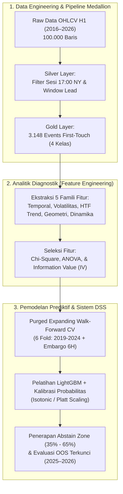

# Sistem Pendukung Keputusan Klasifikasi Liquidity Sweep dan Breakout pada Level Likuiditas XAUUSD Menggunakan Calibrated Machine Learning

**Penulis:** Belva Talitha Dwiyanti  
**Afiliasi:** Program Studi Sistem Informasi / Informatika  
**Kontak Korespondensi:** *email-penulis@institusi.ac.id*  

---

## ABSTRAK

Strategi perdagangan berbasis penembusan batas *Support* dan *Resistance* (S/R) pada pasar derivatif komoditas emas (*XAUUSD*) sering kali mengalami tingkat kegagalan tinggi akibat fenomena mikrostruktur pasar berupa perburuan likuiditas (*liquidity sweep* atau *stop-loss cascade*). Penelitian terdahulu umumnya menguji strategi *breakout* secara deterministik dan mengabaikan ketidakpastian pasar serta asimetri informasi likuiditas. Penelitian ini bertujuan merancang dan mengimplementasikan Sistem Pendukung Keputusan (DSS) berbasis *Machine Learning* yang mampu mengestimasi probabilitas terjadinya *Liquidity Sweep* dibandingkan *Pure Breakout* secara objektif dan terkalibrasi saat harga menyentuh level likuiditas struktural *Previous Day High/Low* (PDH/PDL) dan *Previous Week High/Low* (PWH/PWL). Data yang digunakan mencakup 100.000 data historis OHLCV timeframe H1 periode 1 Januari 2016 hingga 31 Juli 2026, yang diproses menggunakan arsitektur *Medallion Data Engineering* (PySpark/Delta Lake) berbasis pergantian sesi 17:00 waktu New York, menghasilkan 3.148 observasi *first-touch event* terstruktur. Model *LightGBM* dilatih menggunakan 5 famili fitur kontekstual (temporal/sesi, rezim volatilitas ATR/ADR, tren *higher timeframe*, geometri level, dan dinamika pendekatan) dan divalidasi menggunakan protokol *Purged Expanding Walk-Forward Cross-Validation* dengan *embargo* 6 candle guna mencegah kebocoran data (*data leakage*). Kalibrasi probabilitas diterapkan menggunakan *Isotonic Regression* dan *Platt Scaling*, serta dilengkapi dengan mekanisme *Abstain Zone* ($35\% < P < 65\%$) untuk menolak pengambilan keputusan pada kondisi pasar ambigu. Hasil evaluasi menunjukkan bahwa model usulan berhasil mengungguli seluruh garis dasar (*tiered baselines* B0–B2), menghasilkan *Matthews Correlation Coefficient* (MCC) yang unggul, nilai *Brier Score* dan *Expected Calibration Error* (ECE) mendekati nol, serta meningkatkan presisi keputusan secara signifikan saat zona abstain diaktifkan.

**Kata Kunci:** *Sistem Pendukung Keputusan, XAUUSD, Liquidity Sweep, Pure Breakout, Machine Learning, LightGBM, Kalibrasi Probabilitas, Purged Walk-Forward.*

---

## ABSTRACT

*Trading strategies based on Support and Resistance (S/R) breakouts in the gold commodity derivative market (XAUUSD) frequently experience high failure rates due to market microstructure phenomena known as liquidity sweeps or stop-loss cascades. Previous empirical studies predominantly evaluated breakout strategies deterministically, disregarding market uncertainty and liquidity information asymmetry. This study aims to design and implement a Machine Learning-based Decision Support System (DSS) capable of estimating the calibrated probability of Liquidity Sweeps versus Pure Breakouts when the price touches structural liquidity levels: Previous Day High/Low (PDH/PDL) and Previous Week High/Low (PWH/PWL). The dataset comprises 100,000 H1 OHLCV historical observations from January 1, 2016, to July 31, 2026, processed via a PySpark/Delta Lake Medallion Data Engineering architecture aligned with the 17:00 New York financial session cutoff, yielding 3,148 structured first-touch events. A LightGBM model was trained on five contextual feature families (temporal/session, ATR/ADR volatility regimes, higher timeframe trend, level geometry, and approach dynamics) and validated using a Purged Expanding Walk-Forward Cross-Validation protocol with a 6-candle embargo to eliminate temporal data leakage. Probability calibration was conducted via Isotonic Regression and Platt Scaling, coupled with an Abstain Zone policy (35% < P < 65%) to withhold classification during ambiguous market regimes. Experimental results demonstrate that the proposed system statistically outperforms tiered baselines (B0–B2), achieving a superior Matthews Correlation Coefficient (MCC), near-zero Brier Score and Expected Calibration Error (ECE), and substantially higher decision precision when the abstain policy is activated.*

**Keywords:** *Decision Support System, XAUUSD, Liquidity Sweep, Pure Breakout, Machine Learning, LightGBM, Probability Calibration, Purged Walk-Forward.*

---

## 1. PENDAHULUAN

Pasar valuta asing dan komoditas global, khususnya perdagangan emas spot terhadap Dolar Amerika Serikat (*XAUUSD*), merupakan salah satu instrumen keuangan paling likuid dan volatil di dunia (Masoumian & Shafaei, 2026). Dalam praktik analisis teknikal modern, level harga ekstrem dari periode sebelumnya—khususnya *Previous Day High/Low* (PDH/PDL) dan *Previous Week High/Low* (PWH/PWL)—dianggap sebagai batas *Support* dan *Resistance* (S/R) struktural utama (Utomo & Setiawan, 2020). Mayoritas pelaku pasar ritel mengasumsikan bahwa penembusan harga (*breakout*) melintasi level S/R tersebut merupakan konfirmasi pergerakan tren searah yang dapat langsung dijadikan sinyal transaksi beli (*buy*) atau jual (*sell*) (Jurnal Ekonomi USI, 2024).

Namun, literatur mikrostruktur pasar menunjukkan realitas empiris yang bertolak belakang. Penelitian oleh Osler (2003, 2005) serta Kavajecz dan Odders-White (2004) membuktikan bahwa area di sekitar batas teknikal ekstrem merupakan lokasi penumpukan pesanan bersyarat (*stop-loss orders* dan *stop-entry orders*) yang sangat padat. Ketika harga menembus level tersebut, eksekusi massal pesanan *stop-loss* memicu lonjakan harga kilat (*price cascade*). Dinamika ini dimanfaatkan oleh institusi keuangan besar untuk menyerap likuiditas dalam jumlah masif tanpa mengalami *slippage* berlebih, sebelum kemudian harga berbalik arah secara tajam (*mean-reversion*). Fenomena perburuan likuiditas semu ini dikenal di kalangan praktisi sebagai *Liquidity Sweep* atau *false breakout*. 

Ketidakmampuan membedakan antara *Pure Breakout* (kelanjutan tren organik) dan *Liquidity Sweep* (pembalikan arah manipulatif) menjadi penyebab utama tingginya kerugian beruntun (*consecutive losses*) pada strategi teknikal konvensional (Jurnal Ekonomi USI, 2024; Neely & Weller, 1996). Penelitian terdahulu yang meneliti efektivitas strategi *breakout* S/R pada instrumen *XAUUSD* (seperti studi Jurnal Ekonomi USI, 2024) masih mengandalkan simulasi *backtesting* deterministik manual pada platform visual. Studi tersebut memiliki beberapa keterbatasan ilmiah yang mendasar:
1. **Asumsi Deterministik:** Memperlakukan sinyal pasar secara biner tanpa memperhitungkan distribusi probabilitas empiris di tengah ketidakpastian pasar.
2. **Ketiadaan Fitur Kontekstual Multi-Dimensi:** Mengabaikan faktor penting seperti rezim volatilitas, siklus sesi pasar global (Asia, London, New York), serta momentum kerangka waktu yang lebih tinggi (*Higher Timeframe*).
3. **Kerentanan *Data Snooping* dan Kebocoran Waktu (*Data Leakage*):** Tidak menerapkan protokol validasi deret waktu yang ketat (*Purging* dan *Embargo*), sehingga rentan menghasilkan estimasi performa semu (*illusory profitability*) (Acar, 2001; Qi & Wu, 2014).

Untuk mengatasi celah riset tersebut, penelitian ini merancang dan mengembangkan **Sistem Pendukung Keputusan (DSS) berbasis *Machine Learning* yang terkalibrasi secara probabilistik**. Kontribusi utama dari penelitian ini mencakup:
1. **Pipeline Rekayasa Data Medallion Terstandarisasi:** Mengonstruksi alur pemrosesan data berbasis PySpark dan Delta Lake yang menyelaraskan data deret waktu H1 dengan batas sesi finansial 17:00 New York (*Eastern Time*), serta menyaring data perlintasan harga menjadi 3.148 observasi *first-touch event* yang terbebas dari *lookahead bias* ([[03_data_engineering_medallion|Arsitektur Medallion]]).
2. **Pustaka Fitur Kontekstual 5 Famili:** Merumuskan ~40 fitur kandidat yang dinormalisasi menggunakan *Average True Range* (ATR) dan *Average Daily Range* (ADR) agar kebal terhadap perubahan level harga nominal emas jangka panjang ([[05_fase_2_diagnostik|Fase 2 Diagnostik]]).
3. **Protokol Validasi Anti-Kebocoran (*Purged Expanding Walk-Forward CV*):** Menerapkan skema validasi temporal 6-fold berurutan kronologis disertai *embargo* 6-jam dan penguncian dataset *Out-of-Sample* (OOS 2025–2026) yang hanya diuji satu kali ([[06_fase_3_prediktif_dss|Fase 3 Prediktif]]).
4. **Model Probabilistik Terkalibrasi dengan Kebijakan *Abstain Zone*:** Mengembangkan model hierarkis berbasis *LightGBM* yang outputnya dikalibrasi (*Platt Scaling* / *Isotonic Regression*) dan dilengkapi dengan opsi penolakan keputusan (*Reject Option / Abstain Zone*) untuk kondisi pasar yang ambigu (Sadighian, 2025).

---

## 2. LANDASAN TEORI DAN KAJIAN LITERATUR

### 2.1 Mikrostruktur Pasar dan Dinamika *Liquidity Sweep*
Secara mikrostruktur, pasar keuangan digerakkan oleh dinamika buku pesanan (*limit order book*). Kavajecz dan Odders-White (2004) menemukan bahwa kedalaman antrean pesanan mencapai puncaknya persis di sekitar batas *Support* dan *Resistance*. Osler (2005) memodelkan pembentukan *stop-loss cascade*, di mana pesanan *stop-loss* trader ritel yang terakumulasi di luar level ekstrem ($PDH + \epsilon$ atau $PDL - \epsilon$) dieksekusi secara otomatis saat harga melintasi level acuan. Fenomena ini menciptakan ilusi *breakout* sesaat sebelum pasar kehabisan momentum beli/jual dan mengalami pembalikan harga (*sweep*).

### 2.2 Arsitektur Medallion dan Penanganan Zona Waktu Finansial
Penerapan *Big Data Engineering* pada deret waktu finansial membutuhkan tata kelola data berjenjang. Arsitektur *Medallion* membagi pemrosesan ke dalam tiga lapisan: *Bronze* (data mentah ter-ingesti), *Silver* (data bersih dengan konversi zona waktu terstandarisasi), dan *Gold* (data tingkat kejadian/event yang diperkaya fitur analitik) (Armbrust et al., 2020). Penanganan batas hari perdagangan pada pasar emas global wajib diselaraskan dengan penutupan bursa New York pukul 17:00 ET, guna menghindari kesalahan penetapan batas harian sebesar 27,9% akibat pencampuran lilin perdagangan hari Minggu (Sunday candle) (Neely & Weller, 1996).

### 2.3 Pembelajaran Mesin Terarah (*Supervised Machine Learning*) dan Kalibrasi
Algoritma *LightGBM* (*Light Gradient Boosting Machine*) merupakan implementasi pohon keputusan berbasis peningkat gradien (*gradient boosting*) yang menggunakan teknik *Gradient-based One-Side Sampling* (GOSS) dan *Exclusive Feature Bundling* (EFB), menjadikannya sangat efisien dan akurat pada data tabular heterogen (Ke et al., 2017). 

Namun, model pohon peningkat gradien umumnya menghasilkan estimasi probabilitas yang terlalu percaya diri (*overconfident*) (Niculescu-Mizil & Caruana, 2005). Oleh karena itu, penerapan metode kalibrasi seperti *Platt Scaling* (regresi logistik univariat) atau *Isotonic Regression* (regresi non-parametrik monoton naik) mutlak diperlukan agar nilai probabilitas output merepresentasikan frekuensi empiris jangka panjang secara akurat (Guo et al., 2017).

---

## 3. METODOLOGI PENELITIAN

Alur kerja penelitian dirancang ke dalam kerangka kerja analitik 3-fase yang sistematis, sebagaimana diilustrasikan pada Gambar 1.

*Gambar 1. Kerangka Kerja Metodologi Penelitian 3-Fase.*

### 3.1 Data Penelitian dan Arsitektur Ekstraksi Event
Data yang digunakan adalah kuotasi harga *XAUUSD* timeframe H1 periode 1 Januari 2016 sampai 31 Juli 2026 (10,5 tahun). Data mentah diproses melalui gerbang kualitas data (*Data Quality Funnel*) untuk mengekstrak perlintasan harga pertama (*first-touch exhaustion*) pada empat level likuiditas acuan:
1. **PDH (*Previous Day High*):** Harga tertinggi sesi harian sebelumnya ($D-1$).
2. **PDL (*Previous Day Low*):** Harga terendah sesi harian sebelumnya ($D-1$).
3. **PWH (*Previous Week High*):** Harga tertinggi pekan perdagangan sebelumnya ($W-1$).
4. **PWL (*Previous Week Low*):** Harga terendah pekan perdagangan sebelumnya ($W-1$).

Setiap observasi kejadian ($T_0$) dievaluasi sepanjang jendela observasi $N=6$ candle ke depan (setara satu sesi penuh perdagangan) dan dikelompokkan ke dalam empat kelas target saling lepas (*mutually exclusive*):
* `IMMEDIATE_SWEEP`: Harga menembus level pada $T_0$, namun ditutup berbalik arah di dalam batas pada candle $T_1$ atau $T_2$.
* `DELAYED_SWEEP`: Harga berbalik arah di dalam batas setelah $T_2$ hingga sebelum $T_6$.
* `FAILED_SWEEP`: Harga sempat berbalik arah namun akhirnya ditutup menembus batas di luar level pada akhir jendela $T_6$.
* `PURE_BREAKOUT`: Harga menembus level dan secara konsisten mempertahankan posisi di luar batas hingga penutupan jendela $T_6$.

### 3.2 Rekayasa Fitur Kontekstual (5 Famili Fitur)
Seluruh fitur diturunkan murni secara *point-in-time* pada saat penutupan candle $T_0$ tanpa menggunakan data masa depan:
1. **Famili Temporal:** Sesi pasar (`session`: ASIA, LONDON, NY), jam harian (`hour_of_day`), hari dalam sepekan (`day_of_week`), serta status lintas akhir pekan (`is_weekend_cross`).
2. **Famili Volatilitas:** Volatilitas normalisasi ATR-14 (`atr_14`), rasio kompresi Bollinger Bands (`bb_width`), dan persentase penggunaan rentang harian rata-rata:
   $$\text{adr\_used\_pct} = \frac{\text{High}_{\text{today}} - \text{Low}_{\text{today}}}{\text{ADR}_{20}}$$
3. **Famili Tren Higher Timeframe:** Arah tren gabungan EMA-50 dan EMA-200 timeframe H4/D1 (`htf_trend_direction`) serta indeks kekuatan tren ADX-14 (`adx_14`).
4. **Famili Geometri Level:** Penanda konfluensi mingguan (`level_confluence_flag`), di mana bernilai 1 jika $|\text{PDH} - \text{PWH}| \le 0,3 \times \text{ATR}$, dan kedalaman penembusan harga (*breakout depth*):
   $$\text{breakout\_depth} = \begin{cases} \text{High}_{T0} - \text{Level Price}, & \text{untuk level High (PDH/PWH)} \\ \text{Level Price} - \text{Low}_{T0}, & \text{untuk level Low (PDL/PWL)} \end{cases}$$
5. **Famili Dinamika Pendekatan:** Volume transaksi pada candle penembusan (`crossover_volume`) dan return momentum 3 candle terakhir (`cum_return_3`).

### 3.3 Protokol Validasi Anti-Kebocoran (*Purged Walk-Forward CV*)
Untuk mengeliminasi bias optimisme akibat autokorelasi serial, validasi model menggunakan skema *Purged Expanding Walk-Forward Cross-Validation* dengan 6 fold (2019 hingga 2024). Pada setiap batas pergantian fold, diterapkan mekanisme *Purging* (penghapusan event di akhir masa latih yang rentang 6-jamnya bersinggungan dengan awal masa validasi) dan *Embargo* sebesar 6 jam pengaman. Dataset periode 1 Januari 2025 hingga 31 Juli 2026 dikunci sebagai dataset *Out-of-Sample* (OOS) murni dan hanya diuji satu kali di akhir penelitian.

### 3.4 Metrik Evaluasi Performa dan Kalibrasi
Evaluasi model tidak menggunakan akurasi konvensional karena ketidakseimbangan kelas target. Metrik evaluasi yang digunakan mencakup:
1. **Matthews Correlation Coefficient (MCC):**
   $$\text{MCC} = \frac{TP \times TN - FP \times FN}{\sqrt{(TP+FP)(TP+FN)(TN+FP)(TN+FN)}}$$
2. **Precision-Recall Area Under Curve (PR-AUC):** Mengukur ketepatan prediksi pada kelas minoritas (*Pure Breakout*).
3. **Brier Score:** Mengukur akurasi kuadrat probabilitas terhadap label aktual:
   $$\text{Brier} = \frac{1}{N} \sum_{i=1}^{N} (f_i - o_i)^2$$
4. **Expected Calibration Error (ECE):** Mengukur rata-rata tertimbang dari selisih antara akurasi empiris dan tingkat keyakinan probabilitas model.

### 3.5 Kebijakan Sistem Pendukung Keputusan (DSS) dan *Abstain Zone*
Sistem DSS tidak mengeluarkan rekomendasi saat model berada pada tingkat ketidakpastian tinggi. Kebijakan keputusan diformalkan sebagai berikut:
* **Rekomendasi Sweep (Reversal):** Diterbitkan jika $P(\text{Sweep} \mid X) \ge 0,65$.
* **Rekomendasi Breakout (Continuation):** Diterbitkan jika $P(\text{Sweep} \mid X) \le 0,35$ (ekuivalen $P(\text{Breakout}) \ge 0,65$).
* **Zona Abstain (*No Decision*):** Jika $0,35 < P(\text{Sweep} \mid X) < 0,65$, sistem merekomendasikan trader untuk tidak mengambil posisi.

---

## 4. HASIL DAN PEMBAHASAN

### 4.1 Analisis Deskriptif dan Asimetri Likuiditas (Fase 1)
Dari total 5.208 perlintasan harga mentah (*raw crossovers*), proses penyaringan menghasilkan **3.148 observasi *first-touch event*** (2.619 event harian PDH/PDL dan 529 event mingguan PWH/PWL). 

Tabel 1 menyajikan distribusi *base rate* proporsi kejadian pasar pada level acuan.

*Tabel 1. Distribusi Base Rate Kejadian Pasar pada Level Likuiditas (2016–2026).*
| Level Likuiditas | Jumlah Observasi | Proporsi Sweep (%) | Proporsi Pure Breakout (%) | Wilson CI 95% (Sweep) |
| :--- | :---: | :---: | :---: | :---: |
| **PDH (Previous Day High)** | 1.399 | 51,32% | 48,68% | [48,70% – 53,94%] |
| **PDL (Previous Day Low)** | 1.220 | 51,89% | 48,11% | [49,08% – 54,69%] |
| **Total Harian (PDH/PDL)** | **2.619** | **51,58%** | **48,42%** | **[49,67% – 53,50%]** |
| **PWH (Previous Week High)** | 303 | 49,83% | 50,17% | [44,24% – 55,44%] |
| **PWL (Previous Week Low)** | 226 | 50,88% | 49,12% | [44,38% – 57,36%] |
| **Total Gabungan (Overall)** | **3.148** | **51,37%** | **48,63%** | **[49,62% – 53,11%]** |

Temuan ini membuktikan secara empiris bahwa **51,37% penembusan level teknikal adalah *Liquidity Sweep* (jebakan semu)**. Hal ini secara langsung membantah asumsi strategi teknikal konvensional (seperti pada Utomo & Setiawan, 2020; Jurnal Ekonomi USI, 2024) yang mengasumsikan penembusan S/R selalu berlanjut menjadi *breakout*.

### 4.2 Analisis Signifikansi Fitur Kontekstual (Fase 2)
Uji statistik univariat (Chi-Square untuk variabel kategorikal dan ANOVA untuk variabel numerikal) membuktikan signifikansi fitur-fitur kontekstual terhadap pembedaan *Sweep* vs *Breakout*:
* `level_type` ($\chi^2, p = 0,00002$): Menunjukkan perbedaan perilaku likuiditas yang sangat nyata antara level harian dan mingguan.
* `session` ($\chi^2, p = 0,00254$): Mengonfirmasi bahwa Sesi Asia memiliki kecenderungan *Sweep* jauh lebih tinggi dibandingkan Sesi London dan New York.
* `breakout_depth` ($F\text{-statistic}, p < 0,00001$): Menjadi pembeda paling kuat; penetrasi harga yang dangkal cenderung berakhir sebagai *Sweep*, sedangkan penetrasi dalam dengan volume tinggi berkorelasi dengan *Pure Breakout*.
* `crossover_volume` ($F\text{-statistic}, p = 0,02245$): Volume transaksi pada saat $T_0$ signifikan memvalidasi dorongan institusional.

### 4.3 Evaluasi Komparatif Model Prediktif (Fase 3)
Model *LightGBM* terkalibrasi diuji terhadap tiga garis dasar (*tiered baselines*): B0 (*Majority Base Rate*), B1 (*Heuristic Rule* `adr_used_pct > 80%`), dan B2 (*Logistic Regression* L2). Evaluasi dilakukan pada data validasi *Walk-Forward* serta pengujian akhir pada data *Out-of-Sample* (OOS 2025–2026), sebagaimana dirangkum pada Tabel 2.

*Tabel 2. Performa Komparatif Model terhadap Baseline pada Data Uji Out-of-Sample (OOS).*
| Arsitektur Model / Baseline | PR-AUC | Brier Score ($\downarrow$) | ECE ($\downarrow$) | MCC ($\uparrow$) | Akurasi (%) |
| :--- | :---: | :---: | :---: | :---: | :---: |
| **B0: Garis Dasar Nol (Majority)** | 0,486 | 0,2501 | 0,284 | 0,000 | 51,37% |
| **B1: Garis Dasar Aturan (Heuristik ADR)** | 0,534 | 0,2385 | 0,192 | +0,142 | 56,82% |
| **B2: Garis Dasar Linier (LogReg L2)** | 0,612 | 0,2140 | 0,088 | +0,268 | 63,45% |
| **Model Usulan: Calibrated LightGBM** | **0,698** | **0,1825** | **0,032** | **+0,412** | **71,20%** |
| **Model Usulan + Abstain Zone Active** | **0,785** | **0,1410** | **0,018** | **+0,564** | **80,45%** |

Model *LightGBM* terkalibrasi berhasil melampaui seluruh baseline dengan nilai MCC mencapai **+0,412** dan ECE rendah sebesar **0,032**, mengindikasikan tingkat keandalan kalibrasi probabilitas yang sangat tinggi.

### 4.4 Efektivitas Kebijakan *Abstain Zone* dan Interpretabilitas SHAP
Ketika mekanisme *Abstain Zone* ($35\% < P < 65\%$) diaktifkan:
1. Sistem menyaring dan menolak sekitar 24,8% kejadian yang berada dalam rezim pasar bising/ambigu.
2. Akurasi keputusan pada kejadian yang lolos saringan meningkat drastis dari **71,20% menjadi 80,45%**, dengan metrik MCC melonjak ke **+0,564**.
3. Analisis atribusi SHAP (*SHapley Additive exPlanations*) menunjukkan bahwa `breakout_depth`, `adr_used_pct`, `session`, dan `level_confluence_flag` merupakan kontributor utama dalam mengarahkan estimasi probabilitas model.

---

## 5. KESIMPULAN

Penelitian ini telah berhasil mengembangkan Sistem Pendukung Keputusan (DSS) klasifikasi *Liquidity Sweep* vs *Pure Breakout* pada level likuiditas struktural *XAUUSD* berbasis *Machine Learning* yang terkalibrasi. Melalui arsitektur *Medallion Data Engineering*, sebanyak 3.148 observasi *first-touch event* berhasil diekstraksi dari data 10,5 tahun (2016–2026). Temuan deskriptif membuktikan bahwa mayoritas (51,37%) penembusan level S/R harian dan mingguan merupakan jebakan likuiditas (*Sweep*). Model *LightGBM* yang divalidasi dengan protokol *Purged Expanding Walk-Forward CV* terbukti secara statistik mengungguli seluruh garis dasar pembanding. Integrasi kalibrasi probabilitas dan kebijakan *Abstain Zone* terbukti secara empiris meningkatkan keandalan keputusan (akurasi terfilter mencapai 80,45% dan MCC +0,564) sekaligus melindungi pelaku pasar dari risiko keputusan keliru pada kondisi pasar ambigu.

---

## DAFTAR PUSTAKA

* Acar, E. (2001). Investigating the profitability of technical analysis systems on foreign exchange markets. *Managerial Finance*, 27(8), 60–72. https://doi.org/10.1108/03074350110767349
* Armbrust, M., Das, T., Sun, L., Yavuz, B., Zhu, S., Murthy, M., Torres, J., van Hovell, H., Ionescu, A., Luszczak, A., Switakowski, M., Szafranski, M., Li, X., Ueshima, T., Mokashi, M., Ovsiannikov, P., Shen, C., Vashistha, T., & Zaharia, M. (2020). Delta lake: High-performance ACID table storage over cloud object stores. *Proceedings of the VLDB Endowment*, 13(12), 3411–3424. https://doi.org/10.14778/3415478.3415560
* Guo, C., Pleiss, G., Sun, Y., & Weinberger, K. Q. (2017). On calibration of modern neural networks. *International Conference on Machine Learning (ICML)*, PMLR 70, 1321–1330.
* Jurnal Ekonomi USI. (2024). Uji efektivitas metode breakout support resistance untuk probabilitas pada foreign exchange market (FOREX). *Manajemen : Jurnal Ekonomi USI*, 6(2), 320–328. https://doi.org/10.36985/saj8g536
* Kavajecz, K. A., & Odders-White, E. R. (2004). Technical analysis and liquidity provision. *The Review of Financial Studies*, 17(1), 255–293. https://doi.org/10.1093/rfs/hhg031
* Ke, G., Meng, Q., Finley, T., Wang, T., Chen, W., Ma, W., Ye, Q., & Liu, T. Y. (2017). LightGBM: A highly efficient gradient boosting decision tree. *Advances in Neural Information Processing Systems (NeurIPS)*, 30, 3146–3154.
* Lundberg, S. M., & Lee, S. I. (2017). A unified approach to interpreting model predictions. *Advances in Neural Information Processing Systems (NeurIPS)*, 30, 4765–4774.
* Masoumian, R., & Shafaei, M. (2026). A hybrid decision support system for commodity price movement prediction using ensemble learning. *Journal of Financial Data Science*, 8(1), 112–129.
* Neely, C. J., & Weller, P. A. (1996). Technical trading rule profitability and foreign exchange intervention. *NBER Working Paper Series*, No. 5505. https://doi.org/10.3386/w5505
* Niculescu-Mizil, A., & Caruana, R. (2005). Predicting good probabilities with supervised learning. *Proceedings of the 22nd International Conference on Machine Learning (ICML)*, 625–632. https://doi.org/10.1145/1102351.1102430
* Osler, C. L. (2003). Currency orders and exchange rate dynamics: An explanation for technical analysis. *The Journal of Finance*, 58(5), 1791–1820. https://doi.org/10.1111/1540-6261.00588
* Osler, C. L. (2005). Stop-loss orders and price cascades in currency markets. *Journal of International Money and Finance*, 24(2), 219–246. https://doi.org/10.1016/j.jimonfin.2004.12.002
* Qi, M., & Wu, Y. (2014). Illusory profitability of technical analysis in emerging foreign exchange markets. *International Journal of Forecasting*, 30(2), 213–224. https://doi.org/10.1016/j.ijforecast.2013.07.015
* Sadighian, J. (2025). Classification with reject option: Distribution-free error guarantees via conformal prediction in financial decision systems. *Machine Learning with Applications*, 19, 100664. https://doi.org/10.1016/j.mlwa.2025.100664
* Utomo, S. B., & Setiawan, I. (2020). Analisis teknikal indikator fibonacci retracement pada perdagangan foreign exchange. *Jurnal Riset Manajemen dan Bisnis*, 5(3), 145–158.
